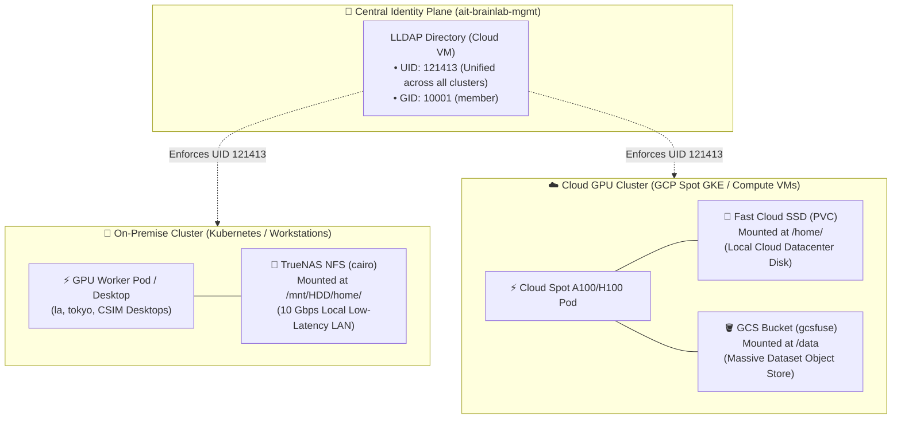
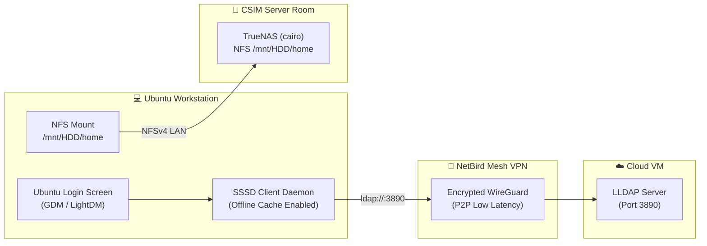

# Hybrid Cloud & Multi-Cluster Architecture (`docs/hybrid_cloud_storage.md`)

## 📌 Executive Summary
AIT Brainlab operates a **Hybrid-Cloud Computing Infrastructure** spanning on-premise compute nodes (`la`, `tokyo`, `cairo` TrueNAS, and physical CSIM workstations) and transient, cost-effective Cloud GPU clusters (GCP Spot GPU VMs, GKE, TPU grants).

This document defines:
1. **Multi-Cluster Kubernetes Storage Architecture** (why cross-WAN NFS is avoided and how storage is abstracted per cluster).
2. **Storage Decoupling Strategy** (`/home` code vs `/data` large datasets vs MLflow artifacts).
3. **Unified Identity & POSIX Synchronization** (how central LLDAP guarantees identical POSIX UIDs/GIDs everywhere).
4. **Physical Desktop Authentication & TrueNAS Mounts** (SSSD over NetBird WireGuard mesh with offline caching).

---

## 🏗️ 1. Multi-Cluster Storage Architecture: On-Prem vs Cloud



---

## 🛑 2. Why Cross-WAN NFS Mounting is Strictly Avoided

Mounting an on-premise TrueNAS NFS share directly over the public internet / VPN into a Cloud GPU VM is an **architectural anti-pattern**:

| Challenge | Impact on Research Workloads | Solution |
| :--- | :--- | :--- |
| **WAN Round-Trip Latency (50–200ms)** | NFS requires synchronous metadata lookups. Training scripts, PyTorch data loaders, and `pip/conda` environments crawl or freeze. | **Cluster-Local Storage**: Storage is local to the compute cluster. |
| **Cloud Bandwidth & Egress Costs** | Streaming 500GB+ datasets from on-prem to cloud saturates bandwidth and costs money. | **GCS Object Storage**: Store cloud datasets in Google Cloud Storage with high-speed internal cloud networking. |
| **Network Hiccups & Pod Hangs** | Any transient WAN drop causes NFS file handles to go stale (`ESTALE`), causing Linux kernels to hang (D-state). | **Cloud Persistent Disks**: High-durability GCP SSDs (`pd-balanced`/`pd-ssd`) for cloud pods. |

---

## 🎯 3. The 3-Tier Storage Decoupling Strategy

To achieve seamless portability between on-premise servers and cloud GPUs, storage is strictly categorized into 3 decoupled tiers:

```
┌────────────────────────────────────────────────────────────────────────────────────────┐
│                              STORAGE DECOUPLING TIERS                                  │
├───────────────────┬───────────────────────────┬────────────────────────────────────────┤
│ TIER              │ ON-PREMISE IMPLEMENTATION │ CLOUD IMPLEMENTATION                   │
├───────────────────┼───────────────────────────┼────────────────────────────────────────┤
│ 1. Code & Configs │ TrueNAS NFS               │ Cloud Disk PVC                         │
│    (/home/<user>) │ (/mnt/HDD/home/<user>)    │ (Backed by GCP SSD, synced via Git)    │
├───────────────────┼───────────────────────────┼────────────────────────────────────────┤
│ 2. Big Datasets   │ TrueNAS Dataset Volume    │ Google Cloud Storage (GCS)             │
│    (/data)        │ (/mnt/HDD/data)           │ (gs://ait-brainlab-datasets + gcsfuse) │
├───────────────────┼───────────────────────────┼────────────────────────────────────────┤
│ 3. ML Artifacts   │ On-Prem MLflow Storage    │ GCS MLflow Artifact Store              │
│    & Weights      │ (tokyo.cs.ait.ac.th:5000) │ (gs://ait-brainlab-mlflow-artifacts)   │
└───────────────────┴───────────────────────────┴────────────────────────────────────────┘
```

### A. Tier 1: User Home & Code (`/home/<user>`)
- Stores personal dotfiles, Git repositories, virtual environments, and scratch scripts.
- **On-Prem K8s**: Backed by `nfs-subdir-external-provisioner` CSI targeting `cairo:/mnt/HDD/home/{username}`.
- **Cloud K8s (GKE)**: Backed by `standard-rwo` / `premium-rwo` Cloud Persistent Disks.
- **Sync**: Code is committed and pulled via **Git (GitHub)**.

### B. Tier 2: Heavy Datasets (`/data`)
- Stores training datasets (e.g. ImageNet, Hugging Face models, Thai NLP corpora).
- **On-Prem**: Mounted directly from `/mnt/HDD/data` via NFS / NVMe caches.
- **Cloud**: Streamed using **Cloud Storage FUSE (`gcsfuse`)** or pre-staged onto local NVMe scratch disks (`/tmp/scratch`) before distributed training runs.

### C. Tier 3: Model Checkpoints & Experiment Tracking
- Managed by **MLflow Platform** (`services/mlflow/`).
- Training jobs in both on-prem and cloud log metrics and artifact weights directly to central MLflow with GCS backend storage.

---

## 👤 4. Why Central LLDAP is the Unifying Anchor

Even though physical storage disks differ between On-Prem and Cloud, **user identity and POSIX mapping are 100% unified**:

1. **Deterministic POSIX UIDs**:
   - `st121413` is **always UID `121413`** on on-premise Ubuntu Desktops, GPU servers (`la`, `tokyo`), TrueNAS, and Cloud Spot GPU containers.
2. **Permission-Safe Synchronization**:
   - When transferring files, checkpoints, or directories between on-prem and cloud via `rclone`, `rsync`, or `gcsfuse`, file ownership is preserved with **zero `chown` mismatches or access denial**.
3. **Zero-Trust Access Control**:
   - Deleting or changing a user's group in `mgmt/terraform/identity/users.tf` immediately updates permissions across all clusters.

---

## 🖥️ 5. Physical Ubuntu Desktop & CSIM Workstation Integration

Physical desktops in the CSIM lab room authenticate against LLDAP and mount TrueNAS NFS using the following architecture:



### SSSD Configuration Template (`/etc/sssd/sssd.conf`)
Each lab desktop runs SSSD with **offline credential caching enabled**:

```ini
[sssd]
services = nss, pam, sudo
domains = brainlab.ldap

[domain/brainlab.ldap]
id_provider = ldap
auth_provider = ldap
chpass_provider = ldap
sudo_provider = ldap

# Connect over private NetBird WireGuard mesh tunnel
ldap_uri = ldap://34.143.234.182:3890
ldap_search_base = dc=brain,dc=cs,dc=ait,dc=ac,dc=th
ldap_user_search_base = ou=people,dc=brain,dc=cs,dc=ait,dc=ac,dc=th
ldap_group_search_base = ou=groups,dc=brain,dc=cs,dc=ait,dc=ac,dc=th

# Service Bind Account (Read-Only)
ldap_default_bind_dn = uid=admin,ou=people,dc=brain,dc=cs,dc=ait,dc=ac,dc=th
ldap_default_authtok = <LLDAP_ADMIN_PASSWORD>

# POSIX Attribute Mapping
ldap_id_use_start_tls = false
ldap_user_object_class = posixAccount
ldap_user_name = uid
ldap_user_uid_number = uidNumber
ldap_user_gid_number = gidNumber
ldap_user_home_directory = homeDirectory
ldap_user_shell = loginShell

# Sudo Management: Members of group 'admin' get full sudo
ldap_group_member = member

# 🛡️ Offline Resilience: Cache credentials locally so desktops work even if internet drops
cache_credentials = true
account_cache_expiration = 14
```

### TrueNAS NFS Mount (`/etc/fstab`)
```bash
cairo.brain.cs.ait.ac.th:/mnt/HDD/home   /mnt/HDD/home   nfs4   rw,soft,intr,bg,rsize=1048576,wsize=1048576   0   0
```

---

## 📊 6. Comprehensive Access & Authentication Matrix

| User Type / Service | Where Authentication Happens | Directory Lookup (AuthZ) | Storage Mount |
| :--- | :--- | :--- | :--- |
| **JupyterHub Web Portal** | 🔑 Google OAuth2 (`@ait.asia` / `@gmail`) | LLDAP (`mail` $\rightarrow$ UID/GID) | TrueNAS `/mnt/HDD/home/<user>` |
| **NetBird Remote VPN** | 🔑 Google OAuth2 (OIDC) | LLDAP Group ACLs | Encrypted P2P WireGuard Mesh |
| **Physical Lab Desktop** | ⌨️ LLDAP User Password (or Cached SSSD) | LLDAP POSIX Schema | TrueNAS `/mnt/HDD/home/<user>` |
| **Headless Compute Nodes** | 🔒 NetBird Setup Key / SSH Public Key | LLDAP SSSD (`admin` $\rightarrow$ sudo) | TrueNAS `/mnt/HDD/home` |
| **Cloud GPU Pods (GKE)** | ☁️ GCP Workload Identity / Kubernetes RBAC | LLDAP UID Synchronization | Cloud SSD PVC + GCS `/data` |
