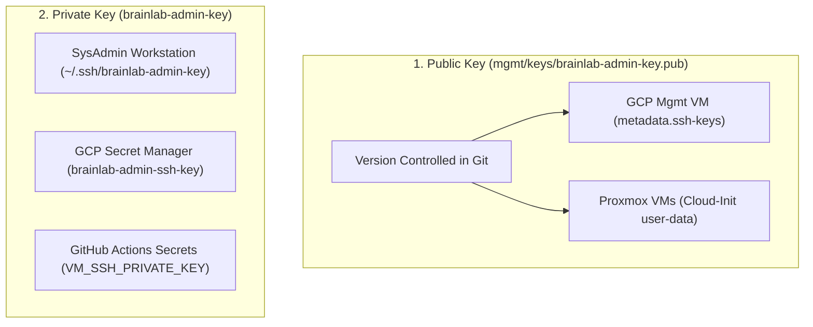

# 🔑 Day-0 Provisioning & Admin Key Recovery Runbook

This document defines the **Day-0 Administrative SSH Key Standard**, automated node provisioning, and disaster recovery procedures for **AIT Brainlab**.

---

## 🏛️ 1. Architecture & Key Distribution

The master administrative key (`brainlab-admin-key`) provides unified, passwordless `sudo` access to `ubuntu` across all lab virtual machines and control plane nodes over the NetBird WireGuard mesh.



| Component | Storage Location | Sensitivity | Purpose |
| :--- | :--- | :---: | :--- |
| **Public Key (`.pub`)** | [`mgmt/keys/brainlab-admin-key.pub`](../../mgmt/keys/brainlab-admin-key.pub) | 🟢 Public | Injected automatically into all VMs on Day-0 via Terraform. |
| **Private Key (Local)** | `~/.ssh/brainlab-admin-key` | 🔴 Secret (600) | Used by SysAdmins for interactive CLI access and node enrollment. |
| **Private Key (Cloud Vault)** | GCP Secret Manager (`brainlab-admin-ssh-key`) | 🔴 Secret | Central disaster recovery backup for lost laptops or co-admin onboarding. |
| **Private Key (CI/CD)** | GitHub Actions (`VM_SSH_PRIVATE_KEY`) | 🔴 Secret | Used by automated deployment runners to deploy containers over SSH. |

---

## 🚀 2. Day-0 Infrastructure Provisioning

When provisioning new infrastructure from scratch, **no manual SSH key generation or copy-pasting is required**:

1. **GCP Management Plane (`mgmt/terraform/vm/`)**:
   Terraform automatically reads `mgmt/keys/brainlab-admin-key.pub` from the repository and attaches it to the instance metadata:
   ```hcl
   metadata = {
     ssh-keys = "ubuntu:${trimspace(file("${path.module}/../../keys/brainlab-admin-key.pub"))}"
   }
   ```
2. **Proxmox Virtual Machines (`onprem/proxmox/terraform/vms/`)**:
   Cloud-Init injects `brainlab-admin-key.pub` into `user: ubuntu` on first boot for all VMs (`brainlab-proxy`, `brainlab-services`, `dlms-server`, etc.).

---

## 🆘 3. Disaster Recovery: Bootstrapping a New Admin Laptop (30 Seconds)

If a SysAdmin gets a new workstation, loses their laptop, or replaces their local disk, restore access with **1 command**:

### Step 1: Download Private Key from GCP Secret Manager
```bash
# 1. Fetch the master admin key
gcloud secrets versions access latest \
  --secret=brainlab-admin-ssh-key \
  --project=ait-brainlab-mgmt > ~/.ssh/brainlab-admin-key

# 2. Enforce strict private key permissions
chmod 600 ~/.ssh/brainlab-admin-key
```

### Step 2: Connect to NetBird Mesh
```bash
netbird up
```

### Step 3: Verify Access to Any Node
```bash
# SSH directly to any server by its NetBird MagicDNS hostname
ssh -i ~/.ssh/brainlab-admin-key ubuntu@brainlab-services
ssh -i ~/.ssh/brainlab-admin-key ubuntu@brainlab-mgmt-vm
ssh -i ~/.ssh/brainlab-admin-key ubuntu@dlms-server
```

---

## 📡 4. Day-1 Node Onboarding: Joining the NetBird Mesh

To enroll any newly provisioned VM or bare-metal host into the NetBird WireGuard mesh:

```bash
# Auto-generate a single-use setup key and enroll target node via SSH:
./mgmt/vpn/enroll_node.py --host 10.10.250.120 --group brainlab-cluster

# Or with an explicit key:
./mgmt/vpn/enroll_node.py --host 10.10.250.120 --setup-key <KEY>
```

---

## 🔄 5. Key Rotation Standard Operating Procedure

To perform an annual or emergency key rotation with **zero downtime and zero lockout risk**:

### Step 1: Run Pre-Flight Dry Run
```bash
python3 mgmt/vpn/rotate_keys.py --dry-run
```

### Step 2: Execute Live Staged Dual-Key Rotation
```bash
python3 mgmt/vpn/rotate_keys.py
```
* The tool automatically generates a new ED25519 keypair, stages the new public key on all NetBird peers (`brainlab-mgmt-vm`, `brainlab-proxy`, `brainlab-services`, `dlms-server`), verifies end-to-end SSH connectivity, and prunes the old key.

### Step 3: Commit Updated Public Key & Update Secrets
1. **Commit to Git**:
   ```bash
   git add mgmt/keys/brainlab-admin-key.pub
   git commit -m "chore(security): rotate brainlab-admin-key"
   git push origin main
   ```
2. **Update GCP Secret Manager**:
   ```bash
   gcloud secrets versions add brainlab-admin-ssh-key \
     --data-file=~/.ssh/brainlab-admin-key \
     --project=ait-brainlab-mgmt
   ```
3. **Update GitHub Secrets**:
   Update `VM_SSH_PRIVATE_KEY` in GitHub Repository Settings.
