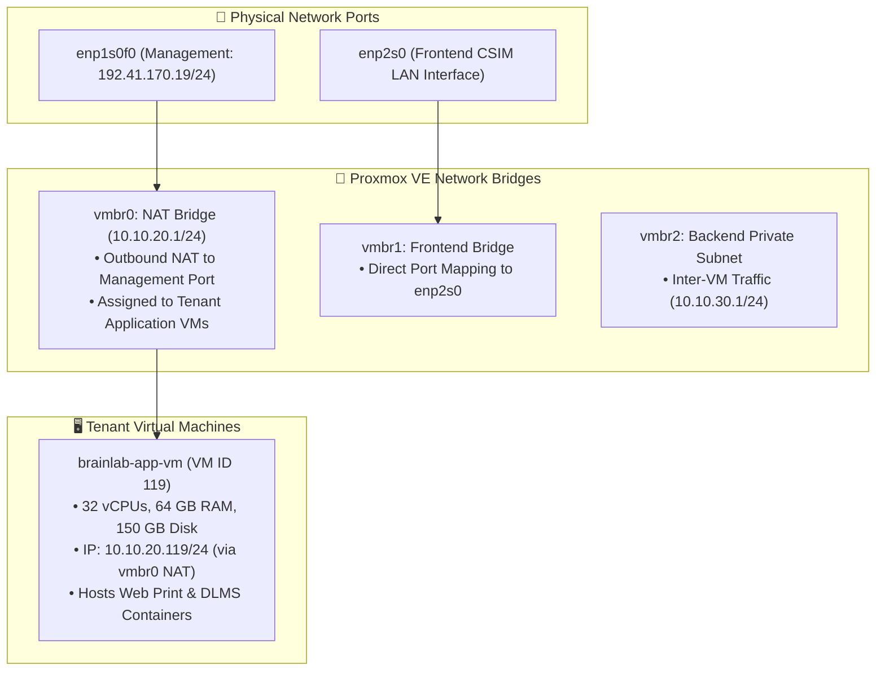
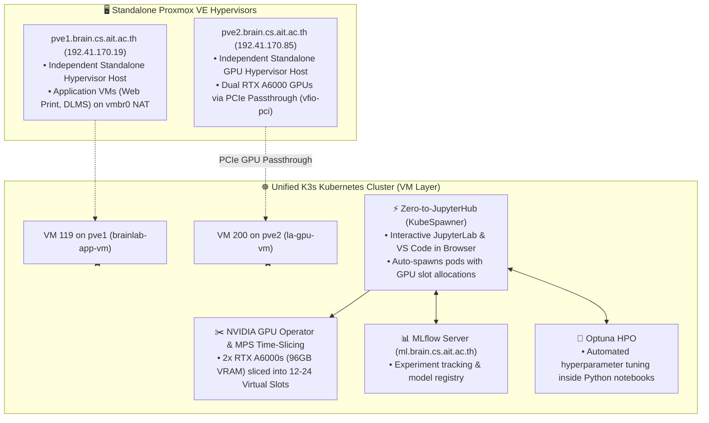

# 🖥️ Proxmox VE Hypervisor Architecture & Governance (`docs/infra/onprem/proxmox_setup.md`)

> **Central On-Premise Hypervisor**: Serves as the physical virtualization host at the AIT Brainlab office (`192.41.170.19`), co-hosting multi-tenant project containers (Remote Web Print, DLMS project backends, RTSP camera ingests, and research staging VMs).

---

## 📌 Hardware & Storage Infrastructure Baseline

| Component | Discovered Live Value | Description / Assignment |
| :--- | :--- | :--- |
| **Node Name** | **`proxmox`** | Physical Proxmox VE hypervisor host |
| **Management IP** | **`192.41.170.19/24`** | Connected via physical management port `enp1s0f0` (Gateway: `192.41.170.23`) |
| **Total CPU Capacity** | **128 vCPUs** | Multi-socket high-performance compute host |
| **Total Memory Capacity** | **134.8 GB RAM** | High-density memory pool |
| **Primary Datastore (`WDBlue`)** | **2.0 TB Total (~1.0 TB Free)** | Type: `lvm`. Primary storage pool for VM root disks (`images, rootdir`) |
| **Secondary Datastore (`local-lvm`)** | **374.5 GB Total (~268.6 GB Free)** | Type: `lvmthin`. Secondary thin-provisioned storage pool |
| **Template Storage (`local`)** | **100.8 GB Total (~54.7 GB Free)** | Type: `dir`. Stores ISOs, Cloud-Init user-data snippets, and container templates (`iso, vztmpl, backup`) |

---

## 🌐 Network Interface & NAT Subnet Topology



---

## 🏗 Proxmox IaC Architecture (Mirroring GCP `mgmt/`)

Just like the Cloud Management Plane (`mgmt/`), On-Premise Proxmox infrastructure follows a **Decoupled 2-Layer Terraform Architecture**:

```text
onprem/terraform/
├── foundation/               # 🛡️ Layer 1: Proxmox Host Governance & Identity
│   ├── main.tf               # Google OIDC Realm, API Token permissions, Network tags
│   ├── variables.tf          # Proxmox endpoint & authentication variables
│   └── outputs.tf            # OIDC realm ID & host status
│
└── proxmox/                  # 🚀 Layer 2: Virtual Machines & Workload Provisioner
    ├── main.tf               # Application VM (ID 119) & Cloud-Init snippet upload
    ├── variables.tf          # 32 vCPU, 64GB RAM, 150GB disk, vmbr0 NAT variables
    ├── outputs.tf            # VM IP, MAC address, and node outputs
    ├── secrets.auto.tfvars   # Git-ignored local API credentials
    └── cloud-init.yaml.tftpl # Automated Docker Engine + NetBird Mesh enrollment
```

---

## 🔐 Google OIDC Single Sign-On (SSO) Governance

Human SysAdmins authenticate to the Proxmox Web GUI (`https://192.41.170.19:8006`) using Google OpenID Connect:

### 1. GCP OAuth Console Configuration
- **Authorized Origins**: `https://192.41.170.19:8006`
- **Authorized Redirect URIs**: `https://192.41.170.19:8006/oauth2/callback`

### 2. Proxmox OIDC Realm Creation CLI
```bash
# Add Google OIDC Realm
pveum realm add google --type openid \
  --issuer-url https://accounts.google.com \
  --client-id "<CLIENT_ID>.apps.googleusercontent.com" \
  --client-key "<CLIENT_SECRET>" \
  --username-claim email \
  --autocreate 1 \
  --default 0 \
  --comment "Google OAuth2 SSO"

# Assign SysAdmin Administrator Permissions
pveum acl modify / --user "akraradet@ait.asia@google" --role Administrator
```

---

## 🚀 Provisioning Workflow

### 1. Terraform Plan & Apply
```bash
cd onprem/terraform/proxmox/

# Verify plan against live host
terraform plan

# Apply VM creation
terraform apply
```

### 2. Automated Bootstrap Execution
Upon boot, Cloud-Init automatically:
1. Installs `docker.io`, `docker-compose-v2`, `curl`, `jq`, and `netbird`.
2. Sets timezone to `Asia/Bangkok`.
3. Auto-enrolls the VM into the NetBird WireGuard overlay mesh under setup key `dlms-server-enrollment` with groups `prj-dlms-servers` and `brainlab-cluster`.

---

## 🔮 Strategic Long-Term AI Platform Roadmap (Standalone Proxmox Hosts + K3s VM Cluster)



### Migration Phases:
1. **Phase 1 (Current Baseline)**: Stand up Proxmox host governance and Application VM 119 (`brainlab-app-vm`) on standalone `pve1` (`192.41.170.19`).
2. **Phase 2 (Standalone Proxmox `pve2`)**: Convert physical bare-metal GPU server `la` (`192.41.170.85`) to standalone Proxmox VE (`pve2.brain.cs.ait.ac.th`) and configure PCIe GPU passthrough (`vfio-pci`).
3. **Phase 3 (Multi-Node K3s Cluster at VM Layer)**: Join VMs across `pve1` and `pve2` into a single K3s Kubernetes cluster, enable NVIDIA MPS Time-Slicing (12-24 student slots), and deploy Zero-to-JupyterHub (`KubeSpawner`) with MLflow and Optuna.
