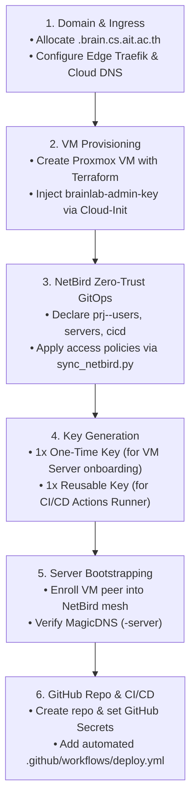

# 🚀 Research Project Lifecycle Standard Operating Procedure (SOP)

This runbook documents the complete end-to-end lifecycle for onboarding a new research project in **AIT Brainlab**—from domain allocation, Proxmox VM provisioning, and NetBird Zero-Trust group creation, to automated CI/CD deployment.

---

## 🗺️ The 6-Step Project Onboarding Pipeline



---

## 📥 Step 0: Project Request & Intake Validation

Before provisioning infrastructure, the SysAdmin verifies the intake request from the research team:

| Input Requirement | Validation Rules | Accepted Formats |
| :--- | :--- | :--- |
| **Project Slug** | Lowercase alphanumeric slug with hyphens | e.g., `dlms`, `smartcity`, `traffic-ai` |
| **Repository URL** | Valid GitHub repository for CI/CD | `https://github.com/AIT-brainlab/<project>` |
| **Domain FQDN** | **Must end with `.brain.cs.ait.ac.th` or `.dpi.ait.ac.th`** | `<project>.brain.cs.ait.ac.th` or `<project>.dpi.ait.ac.th` |
| **Team Accounts** | Registered `@ait.asia` Google accounts | Added to `members.yaml` and NetBird group `prj-<project>-users` |

---

## 📋 Step 1: Domain Allocation & Edge Ingress Routing

### 1. Choose Project Taxonomy
* **Project Name**: `<project>` (e.g. `dlms`, `smartcity`)
* **Domains**:
  * Root Domain: `<project>.brain.cs.ait.ac.th` or `<project>.dpi.ait.ac.th`
  * Wildcard Subdomains: `*.<project>.brain.cs.ait.ac.th` (or `*.<project>.dpi.ait.ac.th`)
* **Proxmox Internal NAT IP**: `10.10.250.X` (e.g., `10.10.250.125`)

### 2. Configure Edge Traefik on `brainlab-proxy`
SSH into `brainlab-proxy` and add the backend route in `/opt/brainlab/proxy/dynamic/projects.yml`:

```yaml
http:
  routers:
    <project>-router:
      rule: "Host(`<project>.brain.cs.ait.ac.th`) || HostRegexp(`{subdomain:[a-z0-9-]+}.<project>.brain.cs.ait.ac.th`)"
      entryPoints: ["websecure"]
      service: "<project>-service"
      tls:
        certResolver: "letsencrypt"

  services:
    <project>-service:
      loadBalancer:
        servers:
          - url: "http://10.10.250.X:80"
```

### 3. Add Cloud DNS Record in Foundation
In [`mgmt/terraform/foundation/dns.tf`](../../mgmt/terraform/foundation/dns.tf), ensure the wildcard DNS record is present:
```hcl
google_dns_record_set.brainlab_a_records["<project>"] = {
  name    = "<project>.brain.cs.ait.ac.th."
  type    = "A"
  rrdatas = ["192.41.170.39"] # Edge Proxy Public IP
}
google_dns_record_set.brainlab_a_records["wildcard_<project>"] = {
  name    = "*.<project>.brain.cs.ait.ac.th."
  type    = "A"
  rrdatas = ["192.41.170.39"]
}
```

---

## 🖥️ Step 2: Proxmox VM Provisioning (Terraform)

### 1. Generate Project SSH Keypair
On your workstation, generate the dedicated project deployment keypair:
```bash
# Generate project deploy keypair
ssh-keygen -t ed25519 -C "deploy@<project>-server" -f ~/.ssh/deploy-<project>

# Copy public key into repo
mkdir -p mgmt/keys/projects
cp ~/.ssh/deploy-<project>.pub mgmt/keys/projects/deploy-<project>.pub
```

### 2. Create VM Definition File
Create `onprem/proxmox/terraform/vms/vm-<project>.tf`:

```hcl
# ==========================================================
# 🚀 VM <ID>: <project>-server
# ==========================================================
resource "proxmox_virtual_environment_file" "cloud_user_data_<project>" {
  content_type = "snippets"
  datastore_id = var.snippet_datastore_id
  node_name    = var.target_node

  source_raw {
    data = templatefile("${path.module}/cloud-init.yaml.tftpl", {
      vm_name                = "<project>-server"
      admin_ssh_public_keys  = var.admin_ssh_public_keys
      deploy_ssh_public_keys = [trimspace(file("${path.module}/../../../../mgmt/keys/projects/deploy-<project>.pub"))]
      dynamic_routes_yaml    = ""
    })

    file_name = "cloud-init-<project>-server.yaml"
  }
}

resource "proxmox_virtual_environment_vm" "<project>_server" {
  name        = "<project>-server"
  description = "Dedicated VM for Project <PROJECT_NAME>"
  node_name   = var.target_node
  vm_id       = <ID>
  tags        = ["brainlab", "onprem", "<project>"]

  agent {
    enabled = true
    timeout = "1s"
  }

  cpu {
    cores = 8
    type  = "host"
  }

  memory {
    dedicated = 16384 # 16 GB RAM
  }

  disk {
    datastore_id = var.datastore_id
    file_id      = "local:iso/ubuntu-24.04-minimal-cloudimg-amd64.img"
    interface    = "scsi0"
    size         = 100 # 100 GB Disk
  }

  network_device {
    bridge = var.bridge
  }

  initialization {
    datastore_id = var.datastore_id

    ip_config {
      ipv4 {
        address = "10.10.250.X/16"
        gateway = "10.10.0.1"
      }
    }

    dns {
      servers = ["192.41.170.15", "8.8.8.8"]
    }

    user_data_file_id = proxmox_virtual_environment_file.cloud_user_data_<project>.id
  }

  lifecycle {
    ignore_changes = [
      initialization[0].user_data_file_id,
    ]
  }
}
```

### 2. Apply Terraform
```bash
cd onprem/proxmox/terraform/vms
terraform apply
```
* The VM boots automatically with Docker, QEMU Guest Agent, and `brainlab-admin-key.pub` injected into user `ubuntu`.

---

## 📡 Step 3: NetBird Zero-Trust Group & Policy Declaration

In [`mgmt/vpn/network.yaml`](../../mgmt/vpn/network.yaml), add the 3 standard groups and access policies:

### 1. Add Device Groups
```yaml
groups:
  # Project Tags: <project>
  - name: prj-<project>-users
    description: "<PROJECT> researchers and operators"

  - name: prj-<project>-servers
    description: "<PROJECT> application and database host VM"

  - name: prj-<project>-cicd
    description: "<PROJECT> GitHub Actions CI/CD deployment runners"
```

### 2. Add Zero-Trust Access Policies
```yaml
policies:
  # 1. Researcher Dev Access to Server
  - name: <PROJECT>-Server-Access
    description: "Allow <PROJECT> researchers and servers to access backend VM"
    enabled: true
    rules:
      - name: <project>-backend-access
        action: accept
        protocol: all
        bidirectional: true
        sources: [prj-<project>-users, prj-<project>-servers]
        destinations: [prj-<project>-servers]

  # 2. CI/CD Deployment Access strictly to Project Server
  - name: <PROJECT>-CICD-Deploy-Access
    description: "Allow <PROJECT> CI/CD runners to SSH deploy strictly to project server"
    enabled: true
    rules:
      - name: <project>-cicd-ssh-access
        action: accept
        protocol: all
        bidirectional: false
        sources: [prj-<project>-cicd]
        destinations: [prj-<project>-servers]
```

### 3. Reconcile Network GitOps
```bash
python3 mgmt/vpn/sync_netbird.py --apply
```

---

## 🔑 Step 4: Generate NetBird Enrollment Keys

Generate **2 distinct setup keys** using the NetBird Web Dashboard or API:

| Key Name | Type | Expiry | Usage Limit | Auto-Groups | Target Audience |
| :--- | :---: | :---: | :---: | :--- | :--- |
| **`ephemeral-<project>-server`** | One-Off | 1 hour | **1 (Single-use)** | `[prj-<project>-servers]` | VM First Boot Enrollment |
| **`<project>-cicd-runner`** | Reusable | 365 days | **0 (Unlimited)** | `[prj-<project>-cicd]` | GitHub Actions Secrets |

---

## 🚀 Step 5: Bootstrap NetBird in VM Server

Run the onboarding tool from your workstation:

```bash
# 1-click automatic enrollment over SSH:
./mgmt/vpn/enroll_node.py \
  --host 10.10.250.X \
  --group prj-<project>-servers

# Or manually via SSH:
ssh -i ~/.ssh/brainlab-admin-key ubuntu@10.10.250.X \
  "curl -fsSL https://raw.githubusercontent.com/AIT-brainlab/brainlab-base/main/docs/infra/onprem/scripts/bootstrap_netbird_csim.sh | sudo bash -s -- <ONE_TIME_KEY>"
```

### Verification:
```bash
# Test connecting via MagicDNS hostname
ssh -i ~/.ssh/brainlab-admin-key ubuntu@<project>-server
```

---

## 🤖 Step 6: Create GitHub Repository & Configure CI/CD

### 1. Add GitHub Repository Secrets
In the new project repository (`AIT-brainlab/<project>`) $\rightarrow$ **Settings** $\rightarrow$ **Secrets and variables** $\rightarrow$ **Actions**:

| Secret Name | Value | Purpose |
| :--- | :--- | :--- |
| `NETBIRD_CI_SETUP_KEY` | The Reusable CI/CD Key (from Step 4) | Joins GitHub runner to NetBird mesh in group `prj-<project>-cicd` |
| `VM_SSH_PRIVATE_KEY` | Contents of `~/.ssh/deploy-<project>` | Authenticates SSH connection to `deploy@<project>-server` |

### 2. Add Deployment Workflow (`.github/workflows/deploy.yml`)

```yaml
name: 🚀 Deploy Application Stack

on:
  push:
    branches: [main]
  workflow_dispatch:

jobs:
  deploy:
    runs-on: ubuntu-latest
    steps:
      - name: Checkout Code
        uses: actions/checkout@v4

      - name: Connect to NetBird Mesh
        uses: netbirdio/netbird-action@v1
        with:
          setup-key: ${{ secrets.NETBIRD_CI_SETUP_KEY }}

      - name: Copy Docker Compose to Target Server
        uses: appleboy/scp-action@v0.1.7
        with:
          host: <project>-server # Resolves via MagicDNS!
          username: deploy
          key: ${{ secrets.VM_SSH_PRIVATE_KEY }}
          target: /projects/<project>
          source: 'docker-compose.yml'

      - name: Pull & Restart Services
        uses: appleboy/ssh-action@v1.0.3
        with:
          host: <project>-server
          username: deploy
          key: ${{ secrets.VM_SSH_PRIVATE_KEY }}
          script: |
            cd /projects/<project>
            echo "${{ secrets.GITHUB_TOKEN }}" | docker login ghcr.io -u ${{ github.actor }} --password-stdin
            docker compose pull
            docker compose up -d --remove-orphans
            docker compose ps
```

---

## 🏁 Summary Matrix: Responsibility & Ownership

| Step | Action | Responsible Role | Tool |
| :---: | :--- | :--- | :--- |
| **1** | Domain & Edge Ingress | Infra Admin | Edge Traefik (`brainlab-proxy`) & Cloud DNS |
| **2** | VM Provisioning | Infra Admin | Proxmox VE + Terraform |
| **3** | NetBird Group & Policy | Infra Admin | `mgmt/vpn/network.yaml` |
| **4** | Setup Key Generation | Infra Admin | NetBird Dashboard / `enroll_node.py` |
| **5** | VM Mesh Enrollment | Infra Admin | `enroll_node.py` / SSH |
| **6** | GitHub Repo & CI/CD | Project Team / DevOps | GitHub Actions + Docker Compose |
