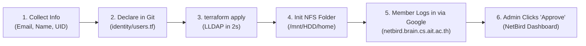

# 📋 Member Onboarding Standard Operating Procedure (SOP)

> **AIT Brainlab Modern GitOps & Google SSO Onboarding Runbook**  
> Covers user identity provisioning in LLDAP (`identity/users.tf`), TrueNAS NFS storage initialization, and NetBird VPN mesh approval.

---

## 🎯 Onboarding Overview & Workflow



---

## 📋 Step-by-Step Onboarding Runbook

### Step 1: Collect Member Information
Collect the following details from the incoming researcher, student, or sysadmin:
- **Full Name**: e.g., `John Doe`
- **AIT Student / Staff ID**: e.g., `123456` (used as numeric Unix UID)
- **Primary Institutional Email**: `st123456@ait.asia` (or `@ait.ac.th`)
- **Personal / Alumni Email** *(Optional)*: `johndoe@gmail.com` (for seamless alumni continuation)
- **Lab Role**:
  - `student` / `member`: Regular researcher (JupyterHub, MLflow, Web Print)
  - `admin`: Infrastructure Administrator (Full SSH, NetBird mesh access to physical servers)

---

### Step 2: Declare User in Identity-as-Code (`mgmt/identity/members.yaml`)

1. Open [`mgmt/identity/members.yaml`](file:///Users/akraradets/Projects/AIT-brainlab/brainlab-base/mgmt/identity/members.yaml).
2. Add the member's profile to the `members` list:
   ```yaml
   - username: johndoe
     display_name: "John Doe"
     primary_email: st123456@ait.asia
     secondary_emails:
       - johndoe@gmail.com             # Optional: personal email for alumni continuation
     uid: 123456                         # Numeric AIT Student ID (UID)
     gid: 2000                          # Primary GID
     home_directory: /mnt/pool-1/home/johndoe
     login_shell: /bin/bash
     groups: [brainlab]
   ```
3. Preview and apply changes to the live LLDAP directory:
   ```bash
   # Preview diff
   ./mgmt/identity/sync_users.py

   # Apply to LLDAP
   ./mgmt/identity/sync_users.py --apply
   ```
   *(LLDAP creates the POSIX user, sets `uidnumber`, `gidnumber`, `homedirectory`, `loginshell`, and binds the group memberships in milliseconds).*

---

### Step 3: Initialize NAS Home Directory on TrueNAS (`cairo`)

On `cairo` or via SSH from a server with `/mnt/HDD/home` mounted:

```bash
# Replace 'johndoe' and '123456' with the member's username and UID:
sudo mkdir -p /mnt/HDD/home/johndoe/work
sudo mkdir -p /mnt/HDD/home/johndoe/.ssh

# Set POSIX ownership matching LLDAP UID and GID (10001):
sudo chown -R 123456:10001 /mnt/HDD/home/johndoe
sudo chmod 700 /mnt/HDD/home/johndoe/.ssh
sudo chmod 755 /mnt/HDD/home/johndoe/work
```

---

### Step 4: NetBird VPN Mesh Enrollment & 1-Click Admin Approval

1. **Member Action (Client Setup)**:
   - Install the NetBird client on their laptop (macOS, Windows, Linux, iOS, Android).
   - In Settings, set **Management URL**: `https://netbird.brain.cs.ait.ac.th` (or `https://netbird2.brain.cs.ait.ac.th`).
   - Click **"Sign in with Google"** and authenticate with their `@ait.asia` Google account.
   - The client will display: `User Approval Pending`.

2. **Admin Action (1-Click Approval)**:
   - The Lab Admin opens [`https://netbird.brain.cs.ait.ac.th`](https://netbird.brain.cs.ait.ac.th) and logs in.
   - Go to **Users** tab.
   - Verify the member's email against `identity/users.tf` and click **Approve**.
   - *(If the member is a SysAdmin)*: Assign their device/user to the **`sysadmin-devices`** group to grant encrypted SSH access to physical GPU servers.

---

### Step 5: Web Services Verification

Send the onboarding welcome guide to the member with the following links:

| Service | URL | Authentication Method |
| :--- | :--- | :--- |
| **🪐 JupyterHub** | [`https://hub.brain.cs.ait.ac.th`](https://hub.brain.cs.ait.ac.th) | 1-Click "Sign in with Google" (`@ait.asia`) |
| **📊 MLflow** | `http://tokyo.cs.ait.ac.th:5000` | Accessible over NetBird WireGuard Mesh |
| **🖨️ Web Print** | [`https://print.brain.cs.ait.ac.th`](https://print.brain.cs.ait.ac.th) | 1-Click "Sign in with Google" (`@ait.asia`) |
| **📁 Research Storage** | `/mnt/HDD/home/<username>/work` | Mounted directly inside JupyterLab containers |

---

## 🔄 Multi-Email Binding (Alumni / Continuation)

When a student graduates or transitions to an external collaborator:
1. Edit [`identity/users.tf`](file:///Users/akraradets/Projects/AIT-brainlab/brainlab-base/mgmt/terraform/identity/users.tf) and update their email to their personal address (e.g. `johndoe@gmail.com`) and add group `"alumni"`.
2. Run `terraform apply`.
3. The user continues accessing their exact same home directory `/mnt/HDD/home/johndoe` with zero data copying or `chown` required.
