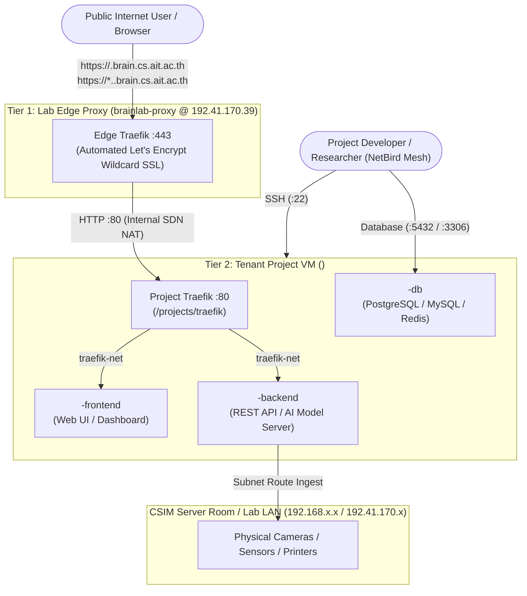

# 🚀 AIT Brainlab: Project Application & Workload Deployment Guide

> **Target Audience**: Research Project Teams, Student Engineers & Developers  
> **Repository**: `AIT-brainlab/brainlab-base`  
> **Architecture Pattern**: Two-Tier Traefik Microservices Ingress on Proxmox Dedicated/Shared VMs with NetBird Zero-Trust Mesh

---

## 📑 Table of Contents
1. [Architecture Overview & Routing Model](#1-architecture-overview--routing-model)
2. [Prerequisites: SSH Key Setup](#2-prerequisites-ssh-key-setup)
3. [NetBird Mesh VPN Connection](#3-netbird-mesh-vpn-connection)
4. [Project Ingress Standard (Zero-Touch Traefik)](#4-project-ingress-standard-zero-touch-traefik)
5. [Docker Compose Deployment Standard](#5-docker-compose-deployment-standard)
6. [Multi-Domain & Microservices Routing](#6-multi-domain--microservices-routing)
7. [Database & Private Resource Access](#7-database--private-resource-access)
8. [On-Premise Hardware & Subnet Device Ingest](#8-on-premise-hardware--subnet-device-ingest)
9. [Troubleshooting & Runbook](#9-troubleshooting--runbook)

---

## 1. Architecture Overview & Routing Model

AIT Brainlab uses a **Two-Tier Decoupled Routing Architecture** designed to give research teams **100% autonomy** over their microservices without complex SSL management or port collisions.



---

## 2. Prerequisites: SSH Key Setup

Each project team is issued a dedicated SSH deployment key by the Lab SysAdmin.

### Step 1: Save the Private Key
1. Create your local `~/.ssh` directory:
   ```bash
   mkdir -p ~/.ssh
   chmod 700 ~/.ssh
   ```
2. Save the key to `~/.ssh/deploy-<project-name>`:
   ```bash
   nano ~/.ssh/deploy-<project-name>
   ```
3. **Enforce strict permissions** (OpenSSH requires `600`):
   ```bash
   chmod 600 ~/.ssh/deploy-<project-name>
   ```

### Step 2: Configure `~/.ssh/config`
Add the following block to your `~/.ssh/config`:

```ssh-config
Host <project>-server
  HostName <project>-server
  User ubuntu
  IdentityFile ~/.ssh/deploy-<project-name>
  IdentitiesOnly yes
  ServerAliveInterval 60
```

> **Fallback IP**: If MagicDNS is ever inactive on your workstation, set `HostName` to the VM's NetBird IP (`100.x.x.x`).

---

## 3. NetBird Mesh VPN Connection

All administrative access (SSH terminal, databases, development endpoints, and internal hardware) is protected behind the **NetBird WireGuard Zero-Trust Mesh**.

1. **Install Client**: Download NetBird for macOS, Linux, or Windows from [netbird.io](https://netbird.io/).
2. **Authenticate**: Sign in with your authorized Google Account (`@ait.asia` or registered project email).
3. **Check Connection**:
   ```bash
   netbird status
   ```
   Ensure `Management: Connected`, `Signal: Connected`, and your target server peer is listed.
4. **Connect via SSH**:
   ```bash
   ssh <project>-server
   ```

---

## 4. Project Ingress Standard (Zero-Touch Traefik)

Every project VM is equipped with a pre-configured project-level Traefik ingress container in `/projects/traefik/`.

### ⚠️ Golden Rules for Developers:
- **DO NOT modify, stop, or touch files in `/projects/traefik/`.**
- Project Traefik listens on host port 80 and monitors Docker socket events.
- SSL/TLS is terminated at the Lab Edge Proxy (`brainlab-proxy`).
- Containers on the VM only need to attach to `networks: [traefik-net]` and declare standard Traefik labels. Traefik automatically hot-reloads routes with zero downtime.

---

## 5. Docker Compose Deployment Standard

All applications, APIs, and databases belonging to your project must be deployed inside `/projects/<project-name>/`.

### Directory Layout Standard:
```text
/projects/
├── traefik/            # ⚠️ System Managed (DO NOT TOUCH)
│   └── docker-compose.yml
└── <project-name>/     # 🚀 Your Application Stack
    ├── docker-compose.yml
    ├── .env
    ├── frontend/
    └── backend/
```

### Complete Production `docker-compose.yml` Boilerplate

Edit `/projects/<project-name>/docker-compose.yml`:

```yaml
services:
  # --------------------------------------------------------
  # 1. Frontend Web Application (Next.js / React / Vue / Nginx)
  # --------------------------------------------------------
  frontend:
    image: ghcr.io/<your-org>/<project>-frontend:latest
    container_name: <project>-frontend
    restart: unless-stopped
    environment:
      - NEXT_PUBLIC_API_URL=https://api.<project>.brain.cs.ait.ac.th
    labels:
      - "traefik.enable=true"
      - "traefik.http.routers.<project>-frontend.rule=Host(`<project>.brain.cs.ait.ac.th`) || Host(`front.<project>.brain.cs.ait.ac.th`)"
      - "traefik.http.routers.<project>-frontend.entrypoints=web"
      - "traefik.http.services.<project>-frontend.loadbalancer.server.port=3000" # Your app's internal container port
    networks:
      - traefik-net

  # --------------------------------------------------------
  # 2. Backend REST API / AI Model Server (FastAPI / PyTorch / Node)
  # --------------------------------------------------------
  backend:
    image: ghcr.io/<your-org>/<project>-backend:latest
    container_name: <project>-backend
    restart: unless-stopped
    environment:
      - DATABASE_URL=postgresql://<db_user>:<db_pass>@<project>-postgres:5432/<db_name>
    labels:
      - "traefik.enable=true"
      - "traefik.http.routers.<project>-backend.rule=Host(`api.<project>.brain.cs.ait.ac.th`) || Host(`back.<project>.brain.cs.ait.ac.th`)"
      - "traefik.http.routers.<project>-backend.entrypoints=web"
      - "traefik.http.services.<project>-backend.loadbalancer.server.port=8000" # Your API's internal container port
    networks:
      - traefik-net
    depends_on:
      - postgres

  # --------------------------------------------------------
  # 3. Dedicated Database (PostgreSQL / MySQL / Redis)
  # --------------------------------------------------------
  postgres:
    image: postgres:16-alpine
    container_name: <project>-postgres
    restart: unless-stopped
    environment:
      POSTGRES_DB: <db_name>
      POSTGRES_USER: <db_user>
      POSTGRES_PASSWORD: <db_password>
    ports:
      # Expose on host so team members can connect directly over NetBird mesh
      - "5432:5432"
    volumes:
      - <project>_postgres_data:/var/lib/postgresql/data
    healthcheck:
      test: ["CMD-SHELL", "pg_isready -U <db_user> -d <db_name>"]
      interval: 10s
      timeout: 5s
      retries: 5
    networks:
      - traefik-net

volumes:
  <project>_postgres_data:
    name: <project>_postgres_data

networks:
  traefik-net:
    external: true
```

### Deployment Commands:
```bash
# 1. SSH into the server
ssh <project>-server

# 2. Navigate to project directory
cd /projects/<project-name>

# 3. Pull latest images and start containers
docker compose pull
docker compose up -d

# 4. Check status & logs
docker compose ps
docker compose logs -f backend
```

---

## 6. Multi-Domain & Microservices Routing

Because the Lab Edge Proxy supports wildcard routing (`*.<project>.brain.cs.ait.ac.th`), your team can deploy any number of microservices on the same VM instantly:

| Subdomain | Recommended Use Case | Traefik Router Label |
| :--- | :--- | :--- |
| **`<project>.brain.cs.ait.ac.th`** | Main Production Web Application | `Host('<project>.brain.cs.ait.ac.th')` |
| **`front.<project>.brain.cs.ait.ac.th`** | Frontend UI / Web App | `Host('front.<project>.brain.cs.ait.ac.th')` |
| **`api.<project>.brain.cs.ait.ac.th`** | Production REST API Gateway | `Host('api.<project>.brain.cs.ait.ac.th')` |
| **`back.<project>.brain.cs.ait.ac.th`** | Model Server / Ingest Backend | `Host('back.<project>.brain.cs.ait.ac.th')` |
| **`dev.<project>.brain.cs.ait.ac.th`** | Staging / Development Environment | `Host('dev.<project>.brain.cs.ait.ac.th')` |
| **`docs.<project>.brain.cs.ait.ac.th`** | Swagger / OpenAPI / MkDocs Portal | `Host('docs.<project>.brain.cs.ait.ac.th')` |

SSL certificates for all subdomains are requested automatically on first visit and renewed by Let's Encrypt.

---

## 7. Database & Private Resource Access

### Connecting from Developer Workstations
Developers connected to the NetBird mesh can connect directly using database GUI tools (**DBeaver**, **TablePlus**, **DataGrip**, **pgAdmin**):

- **Host**: `<project>-server` (or the VM's NetBird IP `100.x.x.x`)
- **Port**: `5432` (PostgreSQL) / `3306` (MySQL)
- **Database**: `<db_name>`
- **User**: `<db_user>`
- **Password**: `<db_password>`
- **URI**: `postgresql://<db_user>:<db_password>@<project>-server:5432/<db_name>`

### Connecting Between Docker Containers
Containers running on the same VM connect using the Docker service name across `traefik-net`:
- **Host**: `<project>-postgres`
- **Port**: `5432`
- **Internal URI**: `postgresql://<db_user>:<db_password>@<project>-postgres:5432/<db_name>`

---

## 8. On-Premise Hardware & Subnet Device Ingest

If your research project consumes live hardware feeds (e.g. RTSP IP cameras, IoT sensors, laboratory instruments, or printers on CSIM LANs):

1. The Lab SysAdmin configures a **NetBird High-Availability Subnet Router** bridging the physical hardware subnet into the mesh.
2. Your backend containers can open direct socket/RTSP connections to internal hardware IPs (e.g. `rtsp://192.168.1.2:554/stream1` or `http://192.41.170.x`).
3. You can test live stream feeds directly from your local laptop using VLC or FFmpeg while connected to NetBird.

---

## 9. Troubleshooting & Runbook

| Problem | Root Cause | Solution |
| :--- | :--- | :--- |
| `Permission denied (publickey)` | Wrong SSH key or permissions too loose | Run `chmod 600 ~/.ssh/deploy-<project>` and verify `~/.ssh/config`. |
| `Could not resolve hostname <project>-server` | NetBird client is disconnected | Run `netbird status`. Reconnect to NetBird VPN. |
| `Connection refused` / `timed out` to DB port | NetBird disconnected or port not mapped | Ensure NetBird is connected and `ports: ["5432:5432"]` is in `docker-compose.yml`. |
| `502 Bad Gateway` on public domain | Application container is down or wrong port | Run `docker compose ps` and verify `traefik.http.services.<name>.loadbalancer.server.port` matches container port. |
| `404 Not Found` on public domain | Traefik label syntax typo or missing network | Ensure container is attached to `networks: [traefik-net]` and `rule=Host(...)` matches domain. |
| Subnet device / camera unreachable | Subnet router node is offline | Contact Lab SysAdmin to verify the physical gateway node (`dsai2`, `la`, `cairo`) is online. |

For infrastructure escalations or additional domain allocations, contact **AIT Brainlab Infrastructure**: `brainlab@ait.asia`.
