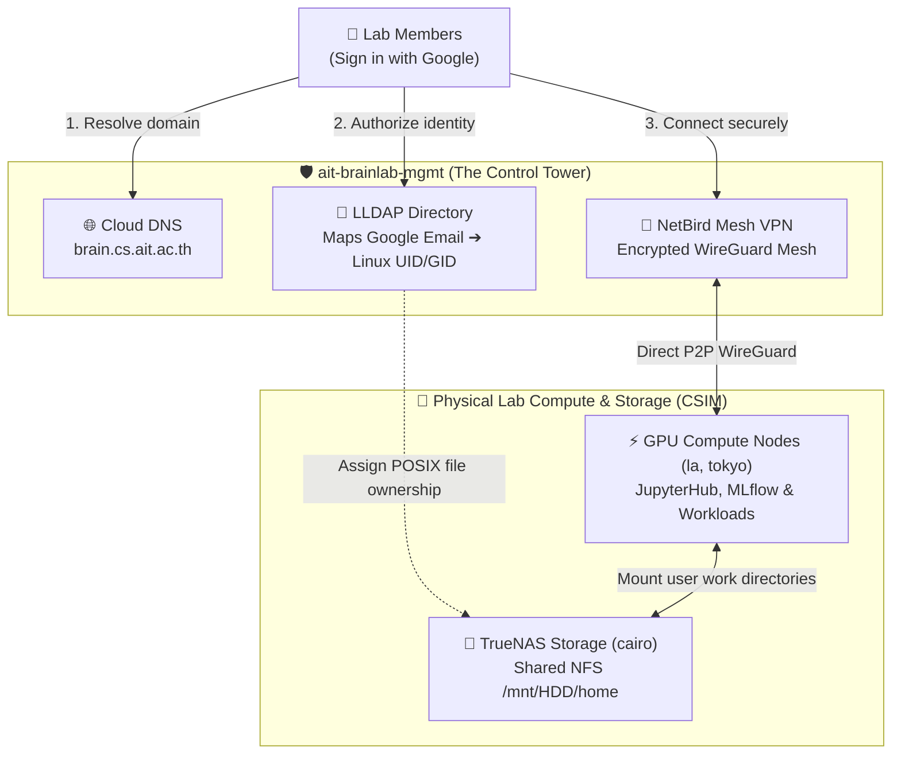

# Core Management Plane (`ait-brainlab-mgmt`)

## 💡 The 30-Second Summary

`ait-brainlab-mgmt` is the **permanent Control Tower** for AIT Brainlab. It costs **<$5/month** and runs zero heavy compute.

It handles **3 essential jobs**:
1. **🌐 Domain Routing (Cloud DNS)**: Directs `*.brain.cs.ait.ac.th` to our physical and cloud services.
2. **👤 Identity & Access (LLDAP)**: Maps Google logins (`@ait.asia`) to Linux file permissions (`UID 1042`) without storing passwords.
3. **📡 Secure Mesh VPN (NetBird)**: Connects student laptops directly to on-prem GPU servers and TrueNAS storage from anywhere.

---

## 🏗️ High-Level Architecture

---

## 🛡️ The 3 Golden Rules (Invariants)

1. **Never Run Heavy Compute Here**:
   - `ait-brainlab-mgmt` is permanent and strictly handles management.
   - GPU instances and student experiments run in separate research projects (`brainlab-res-*`).
2. **Stateless Control Plane ("Cattle, Not Pets")**:
   - The Management VM holds zero irreplaceable data. If it crashes, Terraform recreates it from Git in 20 seconds.
   - All research files live safely on physical **TrueNAS NFS storage (`cairo`)**.
3. **Zero Internal TLS Overhead**:
   - All internal server communication runs inside the **NetBird encrypted WireGuard mesh**. No self-signed certificates or Python TLS hacks.

---

## 👥 Root Governance & Ownership

| Account | Role | Responsibility |
| :--- | :--- | :--- |
| `brainlab@ait.asia` | **Project Owner** | Institutional lab asset ownership |
| `st121413@ait.asia` | **Project Owner** | Lead System Administrator |
| `akraradets@gmail.com` | **Project Owner & Billing** | Permanent personal billing anchor |

---

## 📁 Repository Layout

* [`checklist.md`](checklist.md): Master 7-phase implementation checklist with live verification statuses.
* [`terraform/`](terraform/): Modular Terraform IaC (`iam/`, `dns/`, `secrets/`) backed by GCS remote state (`gs://ait-brainlab-mgmt-tfstate`).
* [`services/identity/`](services/identity/): LLDAP directory configuration, POSIX schema, and SSSD templates.
* [`services/vpn/`](services/vpn/): NetBird WireGuard mesh architecture and server enrollment runbooks.
