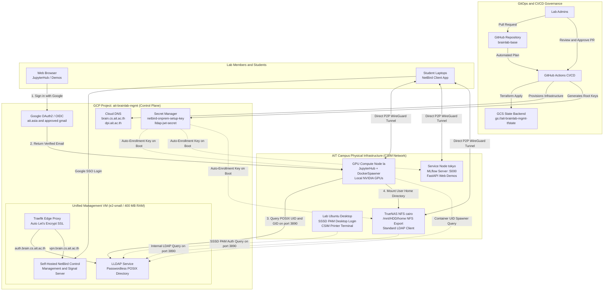

# Core Management Plane (`ait-brainlab-mgmt`)

## 1. Executive Summary & Philosophy

The **AIT Brainlab Core Management Plane** (`mgmt/`) is the permanent, decoupled, low-cost ($0.45 - $7.45/month) control plane for the laboratory.

### Core Architectural Invariants:
1. **Decoupled Billing & Compute**:
   - `ait-brainlab-mgmt` is permanent and funded via institutional accounts.
   - **Never** provision heavy GPU compute or transient research workloads inside `ait-brainlab-mgmt`.
   - Ephemeral research compute belongs in dedicated `brainlab-res-*` projects funded by faculty/PhD grants.
2. **Unified Control Plane VM**:
   - Co-hosts **LLDAP** (Identity / POSIX directory) and **Self-Hosted NetBird** (VPN Control Plane & Signal) on a single lightweight VM (< 400 MB RAM total).
   - Permanently eliminates NetBird device limits and tier upgrade fees ($5/user/month).
   - Single unified backup target (`./data`) protects both identity and network state.
3. **Stateless Infrastructure ("Cattle, Not Pets")**:
   - The Management VM is 100% disposable. If destroyed, running `terraform apply` recreates the infrastructure and restores the directory from Git in seconds.
   - Permanent user research datasets reside safely on physical **TrueNAS NFS storage (`cairo:/mnt/HDD/home`)**.
4. **Terraform Safety Shield**:
   - Critical Cloud DNS zones (`brain.cs.ait.ac.th`, `dpi.ait.ac.th`) and Secret Manager keys (`netbird-onprem-setup-key`, `lldap-jwt-secret`) are shielded with `lifecycle { prevent_destroy = true }`.

---

## 2. End-to-End System Architecture Diagram



---

## 3. Multi-Account Root Governance

| Identity / Account | Role | Purpose | Billing Responsibility |
| :--- | :--- | :--- | :--- |
| `brainlab@ait.asia` | **Project Owner** | Primary institutional account | Long-term institutional asset ownership |
| `st121413@ait.asia` | **Project Owner** | Lead System Administrator | Day-to-day operations & Terraform deployments |
| `akraradets@gmail.com` | **Project Owner & Billing Admin** | Permanent personal backup | Primary billing account attached to `ait-brainlab-mgmt` |

---

## 4. Directory Layout (`mgmt/`)

```
mgmt/
├── README.md                  # This architecture runbook
├── checklist.md               # Master migration & implementation tracker
├── migration_plan.md          # Zero-downtime transition SOP
│
├── terraform/                 # Dedicated Terraform IaC suite
│   ├── main.tf                # GCP APIs & Provider configuration
│   ├── dns.tf                 # Cloud DNS zones (brain.cs.ait.ac.th, dpi.ait.ac.th)
│   ├── iam.tf                 # Root owners & automation service account
│   ├── secrets.tf             # Secret Manager (LLDAP & NetBird keys)
│   ├── budget.tf              # Budget monitoring & alert channels
│   ├── variables.tf           # Configurable inputs & IP addresses
│   ├── outputs.tf             # NS delegation records
│   └── README.md              # Terraform execution runbook
│
└── services/                  # Core Management Services
    ├── dns/                   # DNS verification & delegation scripts
    ├── identity/              # lldap configuration, schema, SSSD templates
    └── vpn/                   # NetBird node enrollment & routing scripts
```

---

## 5. Operational Cost Breakdown

| Component | Target Hosting | Expected Monthly Cost |
| :--- | :--- | :--- |
| **Cloud DNS** | GCP Cloud DNS (2 Managed Zones) | ~$0.45 / month |
| **Unified Control Plane VM** | GCP `e2-small` VM (or on-prem container) | ~$0.00 (On-Prem) to $7.00/mo (GCP) |
| **NetBird Mesh VPN** | Self-Hosted on Management VM | **$0.00 / month (Unlimited Devices)** |
| **Secret Manager** | GCP Secret Manager (3 active secrets) | ~$0.00 / month (Free tier) |
| **Total Management Plane Cost** | | **~$0.45 to $7.45 / month** |
