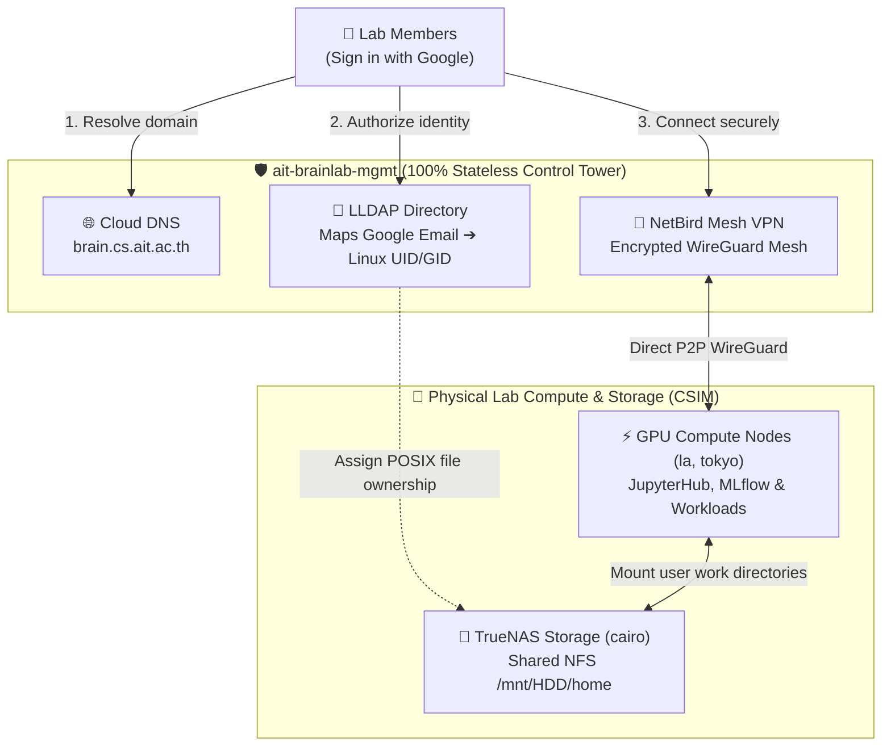

# Core Management Plane (`ait-brainlab-mgmt`)

## 💡 The 30-Second Summary

`ait-brainlab-mgmt` is the **permanent Control Tower** for AIT Brainlab. It costs **<$5/month**, runs zero heavy compute, and is **100% Stateless & Self-Healing**.

It handles **3 essential jobs**:
1. **🌐 Domain Routing (Cloud DNS)**: Directs `*.brain.cs.ait.ac.th` to our physical and cloud services.
2. **👤 Identity & Access (LLDAP)**: Maps Google logins (`@ait.asia`) to Linux file permissions (`UID 1042`) without storing passwords.
3. **📡 Secure Mesh VPN (NetBird)**: Connects student laptops directly to on-prem GPU servers and TrueNAS storage from anywhere.

---

## 🏗️ High-Level Architecture

---

## 🛡️ The 100% Stateless GitOps Matrix

Every single element of the management plane is either **declared in Git** or **self-healing**, eliminating the need for fragile server backups:

| Component | Technology | Where State Lives | Self-Healing / Recovery |
| :--- | :--- | :--- | :--- |
| **👤 User Directory** | LLDAP | Git (`identity/*.tf`) | Terraform re-populates all UIDs & emails on boot in 3s. No passwords stored. |
| **📡 VPN Network** | NetBird | Git (`vpn/*.tf`) | Device groups & ACLs in code. Servers use Secret Manager key; humans use Google. |
| **🌐 Domain Routing** | Cloud DNS | Git (`dns/*.tf`) | 100% managed on Google Anycast network. Zero downtime during VM reboots. |
| **👥 Governance** | IAM | Git (`iam/*.tf`) | Root owners & automation service account versioned in Git. |
| **🔐 Credentials** | Secret Manager | GCP Secret Manager | Protected by `lifecycle.prevent_destroy = true`. |
| **🔒 SSL Certificates** | Traefik | Let's Encrypt ACME | Traefik automatically requests & renews HTTPS certs on boot in 10s. |
| **🖥️ Compute VM** | `e2-micro` | Disposable | 100% Cattle. If destroyed, rebuilt from Git in 45s. |
| **💾 User Data** | TrueNAS NFS | CSIM Server Room | All permanent research files stay safely on physical NAS (`/mnt/HDD/home`). |

---

## 👥 Root Governance & Ownership

| Account | Role | Responsibility |
| :--- | :--- | :--- |
| `brainlab@ait.asia` | **Project Owner** | Institutional lab asset ownership |
| `st121413@ait.asia` | **Project Owner** | Lead System Administrator |
| `akraradets@gmail.com` | **Project Owner & Billing** | Permanent personal billing anchor |

---

## 📁 Repository Layout

* [`checklist.md`](checklist.md): Master 7-phase implementation checklist with live verification statuses.
* [`terraform/`](terraform/): Modular Terraform IaC (`iam/`, `dns/`, `secrets/`, `vm/`, `identity/`, `vpn/`) backed by GCS remote state (`gs://ait-brainlab-mgmt-tfstate`).
* [`services/identity/`](services/identity/): LLDAP directory configuration, POSIX schema, and SSSD templates.
* [`services/vpn/`](services/vpn/): NetBird WireGuard mesh architecture and server enrollment runbooks.
