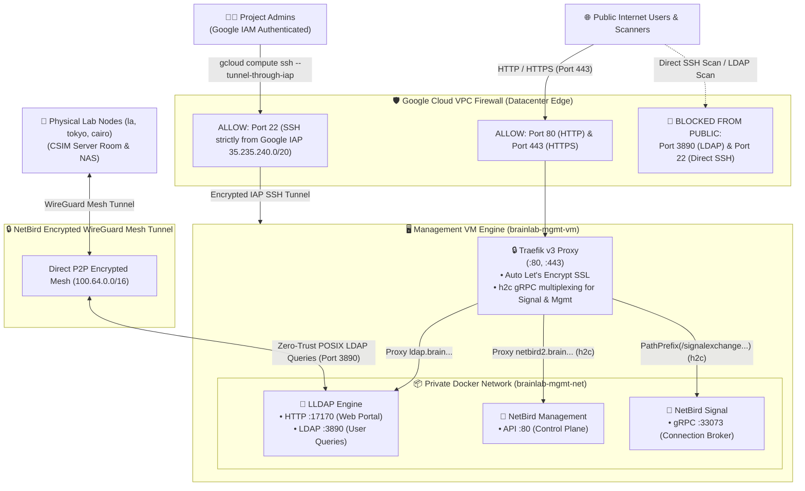

# Core Management Plane (`ait-brainlab-mgmt`)

## 💡 The 30-Second Summary

`ait-brainlab-mgmt` is the **permanent Control Tower** for AIT Brainlab. It costs **<$5/month**, runs zero heavy compute, and is **100% Stateless & Self-Healing**.

It handles **3 essential jobs**:
1. **🌐 Domain Routing (Cloud DNS)**: Directs `*.brain.cs.ait.ac.th` to our physical and cloud services.
2. **👤 Identity & Access (LLDAP)**: Maps Google logins (`@ait.asia`) to Linux file permissions (`UID 1042`) without storing passwords.
3. **📡 Secure Mesh VPN (NetBird)**: Connects student laptops directly to on-prem GPU servers and TrueNAS storage from anywhere.

---

## 🏗️ Master Control Plane & Network Architecture



---

## 🛡️ The 100% Stateless GitOps Matrix

Every single element of the management plane is either **declared in Git** or **self-healing**, eliminating the need for fragile server backups:

| Component | Technology | Where State Lives | Self-Healing / Recovery |
| :--- | :--- | :--- | :--- |
| **👤 User Directory** | LLDAP | Git ([`mgmt/identity/members.yaml`](identity/members.yaml)) + GCS (`backups/lldap/users.db`) | Restored from GCS in 1s on boot. Synced to Git via [`sync_users.py`](identity/sync_users.py). |
| **📡 VPN Network** | NetBird | Web UI / Ansible + GCS (`backups/netbird/store.db`) | Restored from GCS in 1s on boot. Automated peer enrollment via Ansible Day 1. |
| **🌐 Domain Routing** | Cloud DNS | Git ([`foundation/dns.tf`](terraform/foundation/dns.tf)) | 100% managed on Google Anycast network. Zero downtime during VM reboots. |
| **👥 Governance** | IAM | Git ([`foundation/iam.tf`](terraform/foundation/iam.tf)) | Root owners & automation service account versioned in Git. |
| **🔐 Credentials** | Secret Manager | GCP Secret Manager | Protected by `lifecycle.prevent_destroy = true`. |
| **🔒 SSL Certificates** | Traefik | Let's Encrypt ACME | Traefik automatically requests & renews HTTPS certs on boot in 10s. |
| **🖥️ Compute VM** | `e2-micro` | Disposable | 100% Cattle. If destroyed, rebuilt from Git & GCS state in <90s. |
| **💾 User Data** | TrueNAS NFS | CSIM Server Room | All permanent research files stay safely on physical NAS (`/mnt/pool-1/home`). |

---

## 🔑 NetBird Personal Access Token (PAT) Lifecycle SOP

In compliance with NetBird's security model, Personal Access Tokens (PATs) are generated through the official Web UI and stored in GCP Secret Manager:

1. **Initial Provisioning / Rotation**:
   - Log in to the NetBird Web Dashboard at [`https://netbird2.brain.cs.ait.ac.th`](https://netbird2.brain.cs.ait.ac.th) using Google SSO (`brainlab@ait.asia` or `st121413@ait.asia`).
   - Navigate to **Settings** $\rightarrow$ **Access Tokens** $\rightarrow$ **Create Token** (name: `terraform-mgmt`, expiration: 365 days).
   - Upload the plain token to GCP Secret Manager:
     ```bash
     echo -n "nbp_YOUR_TOKEN_HERE" | gcloud secrets versions add netbird-mgmt-token --data-file=- --project=ait-brainlab-mgmt
     ```
2. **Automated Terraform Management (Sequence 6 `vpn/`)**:
   - Terraform reads `netbird-mgmt-token` dynamically from Secret Manager and manages all device groups, ACLs, setup keys, and peers.
3. **Automated Continuous GCS Backup**:
   - The VM takes automated snapshots of `store.db` and `users.db` to `gs://ait-brainlab-mgmt-tfstate/backups/` every 6 hours and on system shutdown.
   - On VM recreation, the database is restored in 1 second, preserving the PAT and all WireGuard mesh connections without manual steps.

---

## 👥 Root Governance & Ownership

| Account | Role | Responsibility |
| :--- | :--- | :--- |
| `brainlab@ait.asia` | **Project Owner** | Institutional lab asset ownership |
| `st121413@ait.asia` | **Project Owner** | Lead System Administrator |
| `akraradets@gmail.com` | **Project Owner & Billing** | Permanent personal billing anchor |

---

## 📁 Repository Layout

* [`checklist.md`](checklist.md): Master 8-phase implementation checklist with live verification statuses.
* [`oauth_setup.md`](oauth_setup.md): Google OAuth2 & OIDC Single Sign-On setup SOP for NetBird, JupyterHub, and Web Print.
* [`migration_plan.md`](migration_plan.md): Zero-downtime on-prem to cloud migration and cutover SOP.
* [`terraform/`](terraform/): Modular Terraform IaC (`iam/`, `dns/`, `secrets/`, `vm/`, `identity/`, `vpn/`) backed by GCS remote state (`gs://ait-brainlab-mgmt-tfstate`).
* [`terraform/vm/`](terraform/vm/): Management VM, Traefik v3.7, LLDAP, NetBird v0.77.0, and monitoring scripts.
* [`terraform/identity/`](terraform/identity/): Identity-as-Code directory & multi-email bindings.
* [`terraform/vpn/`](terraform/vpn/): NetBird-as-Code zero-trust ACLs & server setup keys.

---

## ⏱️ Deployment Benchmarks & Disaster Recovery Metrics

Every deployment and cold rebuild is tracked to maintain sub-5-minute disaster recovery:

| Run / Date | Target | Trigger / Scope | Duration | Status | Notes |
| :--- | :--- | :--- | :--- | :--- | :--- |
| **2026-08-16** | Foundation VM | Initial Day-0 Deployment | 5m 12s | 🔵 Verified | Initial bootstrap with embedded Dex |
| **2026-08-18** | Full DR Wipe | Google OAuth2 + IAM SA + Auto-PAT | 15m 31s | 🔵 Verified | 100% Autonomous zero-touch PAT upload to Secret Manager & Single-Account (`ait.asia`) |

