# Master Implementation & Migration Task Checklist (`mgmt/`)

**Architecture Version**: 2.0 (Consolidated 2-Terraform + GitOps Persistence)  
**Legend**: 🔴 Not Started | 🟡 In Progress | 🟢 Completed | 🔵 Verified

---

## 🎯 Architecture Review & Design Status: 🟢 COMPLETED

- [x] **Consolidated 2-Tier Terraform**:
  - **`foundation/`**: Permanent cloud assets (IAM, Cloud DNS, Secret Manager, Static IP). Deployed once, permanently protected by `prevent_destroy`.
  - **`vm/`**: Disposable `e2-micro` compute instance & VPC firewall rules. 100% Cattle.
- [x] **Decoupled Identity & VPN from Terraform**:
  - **Identity**: Single source of truth in [`mgmt/identity/members.yaml`](../identity/members.yaml). Synchronized to LLDAP via lightweight `sync_users.py` script. Zero third-party Terraform providers (`tasansga/lldap` eliminated).
  - **VPN Control Plane**: Self-hosted NetBird configured via Web UI and Google OAuth2 SSO. Setup keys and device groups are generated dynamically. Zero `local-exec` SSH provisioners (`netbirdio/netbird` eliminated).
  - **VPN Client Mesh Enrollment**: Client enrollment (`netbird-client` on nodes and VM) is decoupled from Day 0 Terraform and delegated to Day 1 Ansible using ephemeral, single-use setup keys (zero keys stored in Secret Manager).
- [x] **Durable GCS SQLite Persistence & Clean Wipe**:
  - `users.db` (LLDAP) and `store.db` (NetBird) are snapshotted to `gs://ait-brainlab-mgmt-tfstate/backups/`.
  - Automated 6-hourly cron and system shutdown backups prevent any data loss across VM lifecycle operations.
- [x] **Multi-Email Binding & AuthN/AuthZ Separation**:
  - Google OAuth2 handles 100% of user authentication.
  - LLDAP maps emails (`@ait.asia`, `@ait.ac.th`, `@gmail.com`) to numeric Unix UIDs (10000+) without storing user passwords.
- [x] **Zero Internal TLS Overhead**:
  - Internal LDAP queries from Linux SSSD and TrueNAS traverse the encrypted NetBird WireGuard mesh tunnel (`ldap://` on port `:3890`).
- [x] **Clean Production Domain Topology**:
  - **Identity**: Production domain `ldap.brain.cs.ait.ac.th` (port 3890 over mesh, 443 via Traefik edge).
  - **VPN**: Production cloud domain `netbird.brain.cs.ait.ac.th` with unified gRPC h2c signaling on port 443.

---

## 📋 Master Execution Sequence

```mermaid
flowchart TD
    subgraph REBUILD ["🔄 Rebuild & Consolidation Transition"]
        R1["💾 R1. Verify GCS Backups<br/>(users.db & store.db)"]
        R2["✂️ R2. Decouple Static IP & DNS<br/>(State rm from old vm)"]
        R3["🗑️ R3. Graceful Teardown<br/>(Destroy vpn, identity, old vm)"]
        R1 --> R2 --> R3
    end

    subgraph PHASE1 ["🛡️ Phase 1: Foundation Module"]
        P1["mgmt/terraform/foundation/<br/>• IAM & Automation SA<br/>• Cloud DNS (brain & dpi)<br/>• Secret Manager Keys<br/>• Ephemeral IP Architecture<br/>🔵 VERIFIED LIVE"]
    end

    subgraph PHASE2 ["🖥️ Phase 2: Disposable Compute VM"]
        P2["mgmt/terraform/vm/<br/>• e2-micro VM Instance<br/>• VPC Firewall Rules<br/>• Unified Docker Compose<br/>  (Traefik, LLDAP, NetBird, Client)<br/>• GCS Database Auto-Restore<br/>🔵 VERIFIED LIVE"]
    end

    subgraph PHASE3 ["👤 Phase 3: Identity GitOps"]
        P3["mgmt/identity/<br/>• members.yaml (33 members)<br/>• LLDAP GraphQL Sync<br/>• GID 2002 brainlab unification<br/>• TrueNAS Storage GID Migration<br/>🔵 VERIFIED LIVE"]
    end

    subgraph PHASE4 ["📡 Phase 4: NetBird Mesh Network"]
        P4["NetBird Control Plane<br/>• Google OAuth2 SSO<br/>• On-prem CSIM Squid Proxy Tunnel<br/>• cairo (TrueNAS) & la Enrolled<br/>🔵 VERIFIED LIVE"]
    end

    subgraph PHASE5 ["🚀 Phase 5: OIDC & Lab Services"]
        P5["JupyterHub & Block Storage<br/>• Google SSO + LLDAP AuthZ<br/>• Dual RTX A6000 GPU Spawner<br/>• TrueNAS NFS & 1TB iSCSI<br/>• Web Print (docker-cups) [Pending]"]
    end

    subgraph PHASE6 ["✂️ Phase 6: Production Cutover"]
        P6["Production Cutover & Decommission<br/>• Repointed DNS to Cloud VM<br/>• SSSD Client Standardization<br/>• Legacy slapd & OpenLDAP Purged<br/>🔵 VERIFIED LIVE"]
    end

    R3 --> PHASE1
    PHASE1 --> PHASE2
    PHASE2 --> PHASE3
    PHASE3 --> PHASE4
    PHASE4 --> PHASE5
    PHASE5 --> PHASE6
```

---

## 🔄 Rebuild & Consolidation Transition

| Task ID | Task Description | Target Identity | Status | Notes / Output |
| :--- | :--- | :--- | :---: | :--- |
| `R.1` | **Verify GCS Database Backups**: Confirm `users.db` and `store.db` snapshots exist in `gs://ait-brainlab-mgmt-tfstate/backups/` | Akraradet | 🔵 | Verified live: `users.db` (139KB) and `store.db` (745KB) snapshotted to GCS |
| `R.2` | **Decouple Static IP & DNS from Old VM State**: Run `terraform state rm google_compute_address.mgmt_ip` and staging DNS records in `mgmt/terraform/vm/` | Akraradet | 🔵 | Successfully removed static IP (`34.143.234.182`) and DNS records from VM state |
| `R.3` | **Teardown Retired Terraform Modules**: Retire `mgmt/terraform/vpn/` and `mgmt/terraform/identity/` | Akraradet | 🔵 | Preserved `netbird-setup-key` in Secret Manager; archived old states to GCS |
| `R.4` | **Destroy Old VM Instance**: Run `terraform destroy` in `mgmt/terraform/vm/` | Akraradet | 🔵 | Successfully destroyed old VM & firewall; Static IP (`34.143.234.182`) preserved in RESERVED status |

---

## 🛡️ Phase 1: Consolidated Foundation (`mgmt/terraform/foundation`)

| Task ID | Task Description | Target Identity | Status | Notes / Output |
| :--- | :--- | :--- | :---: | :--- |
| `1.1` | Consolidate `iam/`, `dns/`, and `secrets/` into `mgmt/terraform/foundation/` | Akraradet | 🔵 | Successfully unified 27 resources into single `foundation` state; zero drift |
| `1.2` | **Project Governance & IAM**: Bind project owners (`brainlab`, `st121413`, `akraradets`) and automation SA (`brainlab-mgmt-terraform`) | Akraradet | 🔵 | Pre-verified in GCP IAM |
| `1.3` | **Cloud DNS Zones & Records**: Permanently manage `brain.cs.ait.ac.th` and `dpi.ait.ac.th` with `lifecycle.prevent_destroy = true` | Akraradet | 🔵 | Pre-verified live delegation |
| `1.4` | **Secret Manager Keys**: Ensure `lldap-jwt`, `lldap-admin-password`, `google-oauth-client-id`, `google-oauth-client-secret` exist | Akraradet | 🔵 | Pre-verified in Secret Manager |
| `1.5` | **Dynamic Public IP Architecture**: Released unattached static IP; VM manages ephemeral IP and dynamically updates DNS | Akraradet | 🔵 | $0 unattached IP cost; dynamic DNS bindings in `vm/` |

---

## 🖥️ Phase 2: Disposable Compute VM Engine (`mgmt/terraform/vm`)

| Task ID | Task Description | Target Identity | Status | Notes / Output |
| :--- | :--- | :--- | :---: | :--- |
| `2.1` | Configure `mgmt/terraform/vm/` with clean `google` provider referencing `foundation` outputs | Akraradet | 🔵 | State: `gs://.../vm`; dynamic ephemeral IP |
| `2.2` | Define VPC Firewall rules for Web (`80`, `443`), NetBird (`33073`), and IAP SSH (`22` from `35.235.240.0/20`) | Akraradet | 🔵 | Zero-trust datacenter edge firewall verified |
| `2.3` | Build unified `docker-compose.yml`: Traefik v3, LLDAP, NetBird Dashboard, Signal, Management + `update_services.sh` | Akraradet | 🔵 | Clean 5-service control plane; version-pinned variables |
| `2.4` | Configure startup script for clean bootstrap, /etc/hosts loopback, and 6-hourly automated backup cron | Akraradet | 🔵 | Verified: SQLite snapshots sync to GCS on boot, shutdown, and cron |
| `2.5` | Run `terraform apply` in `mgmt/terraform/vm/` and verify endpoints (`ldap`, `netbird`) | Akraradet | 🔵 | Verified: HTTP 200 & Let's Encrypt SSL live on both endpoints |

---

## 👤 Phase 3: Identity GitOps Directory (`mgmt/identity`)

| Task ID | Task Description | Target Identity | Status | Notes / Output |
| :--- | :--- | :--- | :---: | :--- |
| `3.1` | Create `mgmt/identity/members.yaml` declaring groups (`admin`, `brainlab`) and 33 lab members | Akraradet | 🔵 | 33 members, numeric UIDs, and Multi-Email Bindings declared |
| `3.2` | Extend LLDAP schema for POSIX Groups (`gidnumber` on `groupSchema`) via GraphQL mutation | Akraradet | 🔵 | Configured group `admin` (GID 2001) and group `brainlab` (GID 2002) |
| `3.3` | Execute `sync_users.py --apply` to synchronize members and primary GIDs | Akraradet | 🔵 | Applied live: all 33 members updated to primary GID 2002; 5 new users seeded |
| `3.4` | Verify directory queries (LDAP authentication and POSIX UID resolution) | Akraradet | 🔵 | Verified live: all 33 members, UIDs, and multi-email bound |
| `3.5` | Provision read-only service account `ldapservice` in `lldap_strict_readonly` with secret `lldap-readonly-password` | Akraradet | 🔵 | Created live in LLDAP; tested and verified via `ldapsearch` over port 3890 |
| `3.6` | **TrueNAS Storage GID Migration**: Recursively update `/mnt/pool-1/home/*` to group `2002:brainlab` | Akraradet | 🔵 | Dispatched via `systemd-run -u fix-groups` on `cairo`; permissions aligned |

---

## 📡 Phase 4: NetBird GitOps & Mesh Network Operations (`mgmt/vpn`)

| Task ID | Task Description | Target Identity | Status | Notes / Output |
| :--- | :--- | :--- | :---: | :--- |
| `4.1` | Initial Google SSO login to NetBird (`https://netbird.brain.cs.ait.ac.th`) as `brainlab@ait.asia` to claim Ownership | Akraradet | 🔵 | Claimed live: `brainlab@ait.asia` is master Account Owner |
| `4.2` | Generate 365-day PAT `gitops-sync` and store in GCP Secret Manager `netbird-mgmt-token` | Akraradet | 🔵 | Successfully stored version 4 in Secret Manager |
| `4.3` | Build Declarative Network-as-Code ([`network.yaml`](vpn/network.yaml)) and Sync Engine ([`sync_netbird.py`](vpn/sync_netbird.py)) | Akraradet | 🔵 | Supports Composable 2-Tag Model, policies, and setup keys |
| `4.4` | Execute `./mgmt/vpn/sync_netbird.py --apply` to reconcile groups, policies, and keys | Akraradet | 🔵 | Applied live: 9 groups, 4 zero-trust policies, and enrollment setup keys |
| `4.5` | Deploy GitHub Action ([`.github/workflows/netbird_pat_reminder.yml`](../.github/workflows/netbird_pat_reminder.yml)) for 365-day PAT reminder | Akraradet | 🔵 | Runs monthly; creates alert issue 30 days before expiration |
| `4.6` | Deploy NetBird Client on Management VM (`brainlab-mgmt-vm`) | Akraradet | 🔵 | Live P2P WireGuard (`100.103.75.243`); `wt0` active; port 3890 verified |
| `4.7` | Deploy NetBird Client on TrueNAS Storage Node (`cairo`) in 25.04 | Akraradet | 🔵 | Enrolled via reusable key (`0B610C4A...`); tags `loc-onprem-csim`, `tier-storage` |
| `4.8` | Configure TrueNAS Directory Services LDAP using internal NetBird URL | Akraradet | 🔵 | Successfully bound to `ldap://ldap.brain.cs.ait.ac.th:3890`; POSIX UID/GID resolution verified |
| `4.9` | Cutover physical GPU compute node (`la`) to Production NetBird | Akraradet | 🔵 | Enrolled via reusable key (`E97E01F0...`); CSIM proxy tunnel and iptables active |
| `4.10` | Verify GCS snapshot captures fresh NetBird configuration in `gs://.../backups/netbird/store.db` | Akraradet | 🔵 | 100% persistent across VM reboots; snapshot uploaded to GCS |

---

## 🚀 Phase 5: Google OIDC & Lab Services (JupyterHub & Storage)

| Task ID | Task Description | Target Identity | Status | Notes / Output |
| :--- | :--- | :--- | :---: | :--- |
| `5.1` | Verify Google OAuth2 credentials in GCP Console (SOP: [`oauth_setup.md`](oauth_setup.md)) | Akraradet | 🔵 | Pre-verified live |
| `5.2` | Configure JupyterHub `oauthenticator.google` with email whitelist & LLDAP spawner hook | Akraradet | 🔵 | Live on `la` (`aitbrainlab/jupyterhub:5.2.1`); Google OAuth2 AuthN + LLDAP AuthZ |
| `5.3` | Verify end-to-end user home directory read/write on TrueNAS NFS (`/mnt/pool-1/home`) | Whole Team | 🔵 | Direct write/delete verified on `la` as user `akraradets` (UID 121413, GID 2002) |
| `5.4` | **Re-authenticate TrueNAS iSCSI Storage**: Connect 1TB `/mnt/docker-root` block device to `la` | Akraradet | 🔵 | Connected over CSIM LAN (`192.41.170.4:3260`); auto-start enabled; documented in `truenas_iscsi.md` |
| `5.5` | **Deploy Web Print Service (`docker-cups`)**: Launch web print portal at `print.brain.cs.ait.ac.th` with Google OAuth2 SSO | Akraradet | 🔴 | Drag-and-drop PDF upload from any browser |
| `5.6` | **Bridge Web Print to CSIM Printer**: Route print jobs over NetBird mesh to on-prem CSIM printer with CSIM quota auth | Akraradet | 🔴 | Print remotely from home/laptops to lab printer |

---

## ✂️ Phase 6: Production Cutover & On-Prem Decommissioning

| Task ID | Task Description | Target Identity | Status | Notes / Output |
| :--- | :--- | :--- | :---: | :--- |
| `6.1` | **Dynamic DNS Routing in Foundation/VM**: Bind `ldap` and `netbird` to Compute VM IP | Akraradet | 🔵 | Auto-bound via startup script; public IP updated in Cloud DNS |
| `6.2` | **Enable Production Domain SSL in Traefik**: Serve production subdomains with Let's Encrypt certificates | Akraradet | 🔵 | Automated TLS termination live on port 443 |
| `6.3` | **Standardize SSSD Client Configuration on `la`**: Deploy canonical `/etc/sssd/sssd.conf` | Akraradet | 🔵 | Configured `enumerate = true`, `groupOfNames`, `ldapservice` auth; committed in `f613d13` |
| `6.4` | **Enroll Production On-Prem Servers**: Run NetBird on `la` and `cairo` with permanent setup keys | Akraradet | 🔵 | Both `cairo` and `la` live on production mesh |
| `6.5` | **Decommission Legacy On-Prem Services**: Stop and disable old OpenLDAP (`slapd`) on `la` and legacy NetBird containers | Phue Pwint Thwe | 🔵 | OpenLDAP (`slapd`) and LAM purged on `la`; old service stopped |
