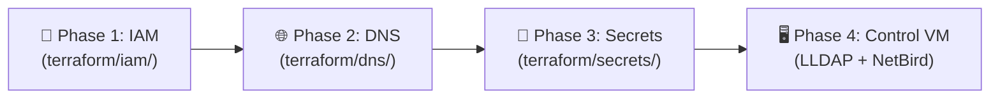

# Master Implementation & Migration Task Checklist (`mgmt/`)

**Legend**: 🔴 Not Started | 🟡 In Progress | 🟢 Completed | 🔵 Verified

---

## 🎯 Architecture Review & Design Status: 🟢 COMPLETED
- [x] **Decoupled Billing & Compute**: Permanent management plane (`ait-brainlab-mgmt`) strictly separate from GPU workloads (`brainlab-res-*`).
- [x] **AuthN vs. AuthZ Decoupling**: Google OAuth2 handles 100% of user authentication & lifecycles; LLDAP acts as a passwordless authorization/POSIX directory.
- [x] **Multi-Email Binding**: Single POSIX UID supports `@ait.asia`, `@ait.ac.th`, and personal alumni `@gmail.com` with zero data copying on TrueNAS.
- [x] **Zero Internal TLS Overhead**: Internal LDAP runs over NetBird WireGuard encrypted mesh tunnel (`ldap://` on port `:3890`).
- [x] **Unified Control Plane VM**: Co-hosts LLDAP + Self-Hosted NetBird on a single lightweight VM (< 400 MB RAM).
- [x] **Modular Terraform Architecture**: Refactored into 3 independent modules (`iam/`, `dns/`, `secrets/`) with `prevent_destroy = true` shields.

---

## 📋 Modular Execution Sequence

---

### 👥 Phase 1: IAM & Project Governance (`mgmt/terraform/iam`)
| Task ID | Task Description | Target Identity | Status | Notes / Output |
| :--- | :--- | :--- | :---: | :--- |
| `1.1` | Run `terraform init` in `mgmt/terraform/iam/` | Akraradet | 🔴 **CURRENT STEP** | Initializes IAM provider |
| `1.2` | Run `terraform plan` and `terraform apply` | Akraradet | 🔴 | Binds project owners (`brainlab`, `st121413`, `akraradets`) |
| `1.3` | Provision `brainlab-mgmt-automation` service account with `roles/dns.admin` | Akraradet | 🔴 | Enables CI/CD capability |

---

### 🌐 Phase 2: Cloud DNS Deployment (`mgmt/terraform/dns`)
| Task ID | Task Description | Target Identity | Status | Notes / Output |
| :--- | :--- | :--- | :---: | :--- |
| `2.1` | Run `terraform init` in `mgmt/terraform/dns/` | Akraradet | 🔴 | Initializes DNS provider |
| `2.2` | Run `bash import_live_records.sh` to adopt live GCP zones & records | Akraradet | 🔴 | Adopts `ait-brainlab` & `dpi-center` |
| `2.3` | Run `terraform plan` and `terraform apply` | Akraradet | 🔴 | Confirms state with 0 to destroy |
| `2.4` | Submit GCP NS record outputs to parent registrar (`cs.ait.ac.th`) | Phue Pwint Thwe | 🔴 | Complete delegation |

---

### 🔐 Phase 3: Secret Manager Deployment (`mgmt/terraform/secrets`)
| Task ID | Task Description | Target Identity | Status | Notes / Output |
| :--- | :--- | :--- | :---: | :--- |
| `3.1` | Run `terraform init` and `terraform apply` in `mgmt/terraform/secrets/` | Akraradet | 🔴 | Generates LLDAP JWT, Admin Password, and NetBird key |
| `3.2` | Verify secret versions in GCP Console / Secret Manager | Akraradet | 🔴 | Protected by `prevent_destroy = true` |

---

### 🖥️ Phase 4: Unified Management VM Deployment (LLDAP + NetBird)
| Task ID | Task Description | Target Identity | Status | Notes / Output |
| :--- | :--- | :--- | :---: | :--- |
| `4.1` | Spin up lightweight Management VM (e2-small on GCP or on-prem container) | Akraradet / Phue Pwint Thwe | 🔴 | < 400 MB RAM total |
| `4.2` | Deploy unified Docker Compose stack (`traefik` + `lldap` + `netbird`) | Phue Pwint Thwe | 🔴 | Base DN: `dc=brain,dc=cs,dc=ait,dc=ac,dc=th` |
| `4.3` | Verify automated Let's Encrypt SSL on `auth.brain.cs.ait.ac.th` & `vpn.brain.cs.ait.ac.th` | Phue Pwint Thwe | 🔴 | HTTPS operational |

---

### 👤 Phase 5: Identity & Directory Import
| Task ID | Task Description | Target Identity | Status | Notes / Output |
| :--- | :--- | :--- | :---: | :--- |
| `5.1` | Export existing user accounts, UIDs, and GIDs from on-premise OpenLDAP | Phue Pwint Thwe | 🔴 | Dump posixAccount attributes |
| `5.2` | Import user entries into `lldap` aligning UIDs/GIDs with TrueNAS (`cairo`) permissions | Phue Pwint Thwe | 🔴 | Preserves `/mnt/HDD/home` file owners |
| `5.3` | Update `/etc/sssd/sssd.conf` on compute nodes & NAS (`cairo`) to point to `lldap:3890` | Phue Pwint Thwe | 🔴 | Connect over NetBird WireGuard mesh |
| `5.4` | Test `getent passwd <user>` and verify NFS home directory read/write access | Phue Pwint Thwe | 🔴 | Test SSH & file access on `cairo` |

---

### 📡 Phase 6: NetBird Mesh Enrollment
| Task ID | Task Description | Target Identity | Status | Notes / Output |
| :--- | :--- | :--- | :---: | :--- |
| `6.1` | Fetch setup key from GCP Secret Manager: `gcloud secrets versions access latest --secret=netbird-onprem-setup-key` | Phue Pwint Thwe | 🔴 | Automatic enrollment token |
| `6.2` | Enroll on-prem servers (`la`, `tokyo`, `cairo`): `sudo netbird up --management-url https://vpn.brain.cs.ait.ac.th --key <KEY>` | Phue Pwint Thwe | 🔴 | Connect physical nodes |
| `6.3` | Verify peer-to-peer ping across mesh network | Whole Team | 🔴 | Direct WireGuard P2P |

---

### 🚀 Phase 7: JupyterHub Google OIDC Integration
| Task ID | Task Description | Target Identity | Status | Notes / Output |
| :--- | :--- | :--- | :---: | :--- |
| `7.1` | Create OAuth2 Client ID & Secret in `GCP Console > APIs & Services` | Akraradet | 🔴 | Web application credential |
| `7.2` | Configure JupyterHub `oauthenticator.google` with email whitelist & LLDAP spawner hook | Akraradet | 🔴 | `@ait.asia`, `@ait.ac.th`, and approved `@gmail.com` |
| `7.3` | Test "Sign in with Google" flow for JupyterHub users | Whole Team | 🔴 | 1-click login + correct NFS mounts |
