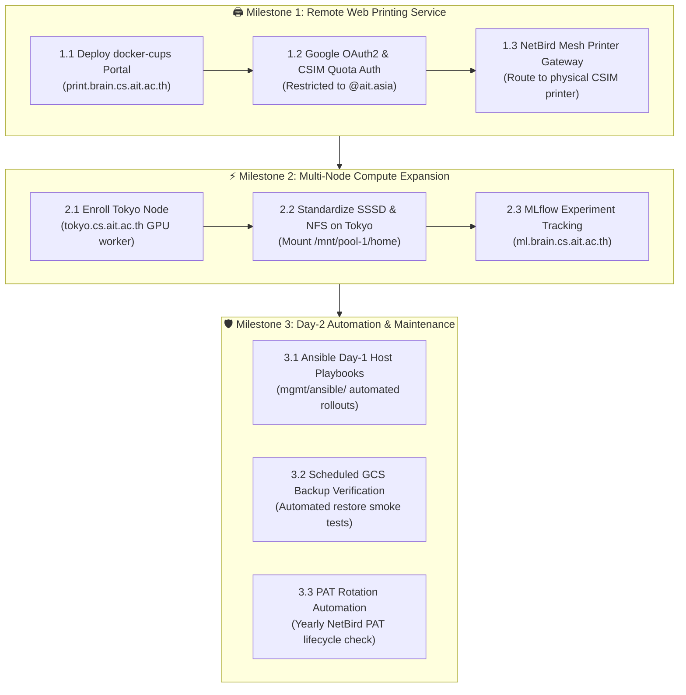

# Management Plane Operations & Next Steps Roadmap (`mgmt/`)

**Architecture Version**: 2.0 (Consolidated 2-Tier Terraform + GitOps Persistence)  
**Status Legend**: 🔴 Planned / Not Started | 🟡 In Progress | 🟢 Completed | 🔵 Verified Live

---

## 🏛️ Verified Production Baseline (Completed Milestones)

The cloud management plane (`ait-brainlab-mgmt`) has completed all foundational migration milestones and operates in steady state:

| Layer | Architecture Component | Live State | Verification Summary |
| :--- | :--- | :---: | :--- |
| **Foundation** | `mgmt/terraform/foundation/` | 🔵 | Authoritative Cloud DNS (`brain.cs.ait.ac.th`, `dpi.ait.ac.th`), IAM governance, Secret Manager prerequisite keys (`lldap-jwt`, `lldap-admin-password`, Google OAuth credentials). |
| **VM Engine** | `mgmt/terraform/vm/` | 🔵 | Disposable `e2-micro` VM with dynamic public IP auto-bound to Cloud DNS. Traefik v3 edge proxy (Let's Encrypt TLS), LLDAP, NetBird dashboard, Signal, and Management. Automated 6-hourly GCS SQLite snapshots. |
| **Identity GitOps** | `mgmt/identity/` | 🔵 | Declarative `members.yaml` (33 members) synchronized via GraphQL (`sync_users.py`). Unified GID `2002:brainlab`, Multi-Email Bindings, dedicated `ldapservice` service account (`:3890`). |
| **VPN Networks** | `mgmt/vpn/` | 🔵 | Declarative NetBird network (`network.yaml` + `sync_netbird.py`). High-Availability Subnet Gateways across CSIM 10GbE LAN (`cairo` + `la`), DLMS network, and MagicDNS CNAME for locked-down admin endpoints. |
| **Core Compute** | Physical Server `la` | 🔵 | Dual RTX A6000 JupyterHub (`https://la.cs.ait.ac.th`) with Google OAuth2 AuthN, LLDAP AuthZ, TrueNAS NFS `/mnt/pool-1/home` direct mounts, 1TB iSCSI `/mnt/docker-root`, SSSD client standardization (`groupOfNames`). Legacy `slapd` decommissioned. |

---

## 🎯 What's Next: Upcoming Deliverables & Service Roadmap

---

## 📋 Actionable Task Matrix

### 🖨️ 1. Remote Web Printing Service (`services/printing/`)

| Task ID | Task Description | Owner | Priority | Status | Details / Deliverable |
| :--- | :--- | :---: | :---: | :---: | :--- |
| `NEXT-1.1` | **Deploy Web Print Portal (`docker-cups`)** | Akraradet | P1 | 🔴 | Launch containerized web upload portal on `print.brain.cs.ait.ac.th` accepting PDF/PS submissions via Traefik. |
| `NEXT-1.2` | **Configure Google OAuth2 Authentication** | Akraradet | P1 | 🔴 | Restrict web portal access strictly to `@ait.asia` members using the pre-configured GCP OAuth redirect `https://print.brain.cs.ait.ac.th/oauth2/callback`. |
| `NEXT-1.3` | **Bridge Web Print to CSIM Physical Printer** | Akraradet | P1 | 🔴 | Configure CUPS backend routing over NetBird WireGuard mesh to the CSIM on-prem network printer (`192.41.170.x`), supporting student CSIM quota accounting. |

---

### ⚡ 2. Secondary Compute Node (`tokyo`) & ML Services

| Task ID | Task Description | Owner | Priority | Status | Details / Deliverable |
| :--- | :--- | :---: | :--- | :---: | :--- |
| `NEXT-2.1` | **Enroll `tokyo` into Production NetBird Mesh** | Akraradet | P2 | 🔴 | Connect physical server `tokyo` using reusable setup key `brainlab-cluster-enrollment` via NetBird CSIM forward proxy. |
| `NEXT-2.2` | **Deploy SSSD & TrueNAS NFS on `tokyo`** | Akraradet | P2 | 🔴 | Apply canonical `sssd.conf` (querying `ldap://brainlab-mgmt-vm:3890`) and autofs/fstab mounts for `/mnt/pool-1/home`. |
| `NEXT-2.3` | **Stand up MLflow Experiment Server (`ml.brain.cs.ait.ac.th`)** | Phue | P2 | 🔴 | Deploy MLflow tracking server with SQLite/PostgreSQL metadata backend and TrueNAS artifact storage for lab experiments. |

---

### 🛡️ 3. Day-2 Automation & Maintenance

| Task ID | Task Description | Owner | Priority | Status | Details / Deliverable |
| :--- | :--- | :---: | :--- | :---: | :--- |
| `NEXT-3.1` | **Complete Ansible Host Enrollment Playbooks** | Akraradet | P2 | 🟡 | Finalize `mgmt/ansible/enroll_netbird.yml` and `roles/netbird-client` for automated, zero-touch provisioning of future Ubuntu nodes. |
| `NEXT-3.2` | **Automated Disaster Recovery Smoke Test** | Akraradet | P3 | 🔴 | Script a sandbox test that restores `users.db` and `store.db` from `gs://ait-brainlab-mgmt-tfstate/backups/` to verify zero-corruption recovery under 90s. |
| `NEXT-3.3` | **Annual NetBird PAT Rotation Drill** | Whole Team | P3 | 🟢 | Monitored by `.github/workflows/netbird_pat_reminder.yml` (runs 1st of every month; triggers alert 30 days before expiration). |
