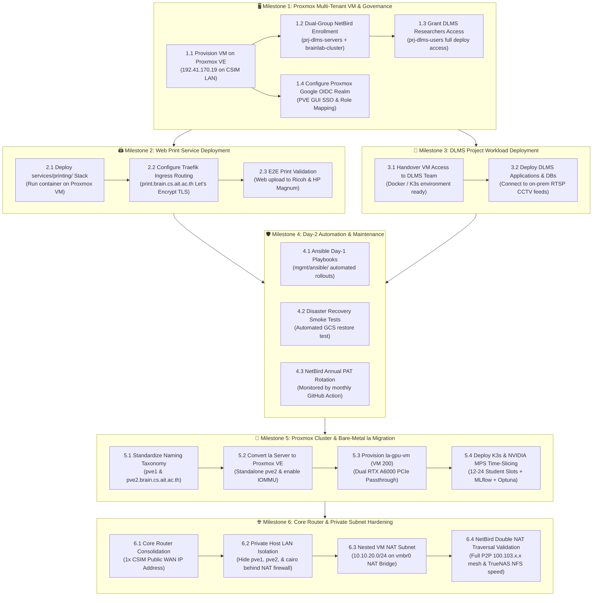

# Management Plane Operations & Next Steps Roadmap (`mgmt/`)

**Architecture Version**: 2.1 (Proxmox Shared Application VM, Web Print & DLMS Integration)  
**Status Legend**: 🔴 Planned / Not Started | 🟡 In Progress | 🟢 Completed | 🔵 Verified Live

---

## 🏛️ Verified Production Baseline (Completed Milestones)

The cloud management plane (`ait-brainlab-mgmt`) has completed all foundational migration milestones and operates in steady state:

| Layer | Architecture Component | Live State | Verification Summary |
| :--- | :--- | :---: | :--- |
| **Foundation** | `mgmt/terraform/foundation/` | 🔵 | Authoritative Cloud DNS (`brain.cs.ait.ac.th`, `dpi.ait.ac.th`), IAM governance, Secret Manager prerequisite keys (`lldap-jwt`, `lldap-admin-password`, Google OAuth credentials). |
| **VM Engine** | `mgmt/terraform/vm/` | 🔵 | Disposable `e2-micro` VM with dynamic public IP auto-bound to Cloud DNS. Traefik v3 edge proxy (Let's Encrypt TLS), LLDAP, NetBird dashboard, Signal, and Management. Automated 6-hourly GCS SQLite snapshots. |
| **Identity GitOps** | `mgmt/identity/` | 🔵 | Declarative `members.yaml` (33 members) synchronized via GraphQL (`sync_users.py`). Unified GID `2002:brainlab`, Multi-Email Bindings, dedicated `ldapservice` service account (`:3890`). |
| **VPN Networks** | `mgmt/vpn/` | 🔵 | Declarative NetBird network (`network.yaml` + `sync_netbird.py`). High-Availability Subnet Gateways across CSIM 10GbE LAN (`cairo` + `la`), DLMS network, and MagicDNS CNAME for locked-down admin endpoints. Added `csim-printers` network group (`banyan`, `ricoh`, `magnum`). |
| **Core Compute** | Physical Server `la` | 🔵 | Dual RTX A6000 JupyterHub (`https://la.cs.ait.ac.th`) with Google OAuth2 AuthN, LLDAP AuthZ, TrueNAS NFS `/mnt/pool-1/home` direct mounts, 1TB iSCSI `/mnt/docker-root`, SSSD client standardization (`groupOfNames`). Legacy `slapd` decommissioned. |
| **Retired Compute** | Physical Server `tokyo` | ⚪ | **Retired / Decommissioned**. Compute workloads consolidated on `la` and cloud Spot GPUs. |
| **Print POC & Spooler** | LPD Engine (`192.41.170.5`) | 🔵 | Physical test page successfully printed to CSIM Lobby **Ricoh IM C2000** over NetBird mesh via `banyan.cs.ait.ac.th:515` using RFC 1179 LPD protocol with automatic CSIM student quota attribution (`Pst121413`). |
| **Print Service Code** | `services/printing/` | 🟢 | Full production codebase drafted: FastAPI app, Google OAuth2 SSO, `members.yaml` student ID resolver, pure-Python LPD client, 10× color quota guardrail, and Tailwind drag-and-drop UI. |

---

## 🎯 What's Next: Upcoming Deliverables & Service Roadmap

---

## 📋 Actionable Task Matrix

### 🖥️ 1. Proxmox Multi-Tenant Application VM & Hypervisor Governance

| Task ID | Task Description | Owner | Priority | Status | Details / Deliverable |
| :--- | :--- | :---: | :---: | :---: | :--- |
| `NEXT-1.1` | **Provision Application VMs on Proxmox VE** | Akraradet | P1 | 🟢 | Completed: Provisioned `brainlab-proxy` (VM 100), `dlms-server` (VM 119), and `brainlab-services` (VM 120) via `onprem/proxmox/terraform/vms/` IaC module with GCS remote state persistence (`gs://ait-brainlab-mgmt-tfstate/onprem/proxmox/vms`). |
| `NEXT-1.2` | **Dual-Group NetBird Mesh Enrollment** | Akraradet | P1 | 🟢 | Completed: Enrolled `brainlab-proxy` (`192.41.170.39`) & `brainlab-services` (`100.74.10.218`) into `brainlab-cluster`, and `dlms-server` (`100.74.18.96`) into `prj-dlms-servers`. |
| `NEXT-1.3` | **Deploy Edge Proxy & Declarative Dynamic Routing** | Akraradet | P1 | 🔵 | Completed: Configured Traefik v3.7 on `brainlab-proxy` with Let's Encrypt SSL/TLS, Squid proxy egress (`192.41.170.82:3128`), and hot-reloading dynamic file routing (`/opt/brainlab/traefik/dynamic/routes.yaml`). Verified valid production SSL certificates on `example.brain.cs.ait.ac.th`, `dlms.brain.cs.ait.ac.th`, `dlms-dev.brain.cs.ait.ac.th`, and `print.brain.cs.ait.ac.th`. |
| `NEXT-1.4` | **Configure Proxmox Google OIDC SSO Realm** | Akraradet | P2 | 🔴 | Register `https://192.41.170.19:8006/oauth2/callback` in GCP OAuth Console. Configure Google OpenID Connect (OIDC) realm in Proxmox VE (`pveum realm add google --type openid`), set default role `NoAccess`, and map SysAdmin `@ait.asia` accounts to `Administrator` / `PVEAdmin`. |
| `NEXT-1.5` | **Two-Tier Lab Web Deployment Template** | Akraradet | P1 | 🔵 | Completed: Created `services/template/` boilerplate (`docker-compose.yml` & `README.md`) using Project-Level Traefik (HTTP Port 80 only) with edge SSL offloading at `brainlab-proxy` and declarative Terraform route management (`var.proxy_routes`). Deployed and verified live on `brainlab-services` (`https://example.brain.cs.ait.ac.th`). |

---

### 🖨️ 2. Remote Web Print Service Production Rollout (`services/printing/`)

| Task ID | Task Description | Owner | Priority | Status | Details / Deliverable |
| :--- | :--- | :---: | :---: | :---: | :--- |
| `NEXT-2.1` | **Draft Web Print Service Codebase** | Akraradet | P1 | 🟢 | Completed: FastAPI backend, pure-Python RFC 1179 LPD spooler, Google OAuth2, single source of truth URL `members.yaml` identity mapping, 10× color warning. |
| `NEXT-2.2` | **Deploy Web Print on Proxmox Services VM** | Akraradet | P1 | 🔵 | Completed & Verified Live: Deployed unified services compose stack on `brainlab-services` (`10.10.250.2` / NetBird `100.74.10.218`) running project Traefik (Port 80), `web-print`, and `example-app`. |
| `NEXT-2.3` | **Expose `print.brain.cs.ait.ac.th` via Traefik Edge** | Akraradet | P1 | 🔵 | Completed & Verified Live: Cloud DNS A record, edge Traefik route on `brainlab-proxy` (`192.41.170.39`), and Let's Encrypt production SSL active and serving 200 OK. |
| `NEXT-2.4` | **End-to-End Web Print Verification** | Akraradet | P1 | 🔴 | Submit test PDF from external browser via Google login to Ricoh (Lobby) and HP Magnum (Room 212); verify quota accounting. |

---

### 🚗 3. DLMS Project Workload Deployment

| Task ID | Task Description | Owner | Priority | Status | Details / Deliverable |
| :--- | :--- | :---: | :---: | :---: | :--- |
| `NEXT-3.1` | **Hand over Environment to DLMS Researchers** | Akraradet | P2 | 🟢 | Completed: Confirmed members in `prj-dlms-users` (`oakaugustine@gmail.com`, `ppthwe99@gmail.com`, `ephoney1141@gmail.com`) can connect via NetBird; CNAME `dlms-dev.brain.cs.ait.ac.th` active. |
| `NEXT-3.2` | **Deploy DLMS Application Containers** | DLMS Team | P2 | 🔵 | Completed & Live: Deployed project-level Traefik (Port 80) and frontend on `dlms-server` (`10.10.250.1:80`). Verified public HTTPS routing via `brainlab-proxy` (`https://dlms.brain.cs.ait.ac.th` & `https://dlms-dev.brain.cs.ait.ac.th`). Ready for backend API, database, and RTSP stream ingest containers (`192.168.1.2` and `192.168.1.3`). |

---

### 🛡️ 4. Day-2 Automation & Maintenance

| Task ID | Task Description | Owner | Priority | Status | Details / Deliverable |
| :--- | :--- | :---: | :--- | :---: | :--- |
| `NEXT-4.1` | **Complete Ansible Host Enrollment Playbooks** | Akraradet | P2 | 🟡 | Finalize `mgmt/ansible/enroll_netbird.yml` for automated zero-touch provisioning of Proxmox VMs and future nodes. |
| `NEXT-4.2` | **Disaster Recovery GCS Restore Smoke Test** | Akraradet | P3 | 🔴 | Script a sandbox test that restores `users.db` and `store.db` from `gs://ait-brainlab-mgmt-tfstate/backups/`. |
| `NEXT-4.3` | **Annual NetBird PAT Rotation Monitoring** | Whole Team | P3 | 🟢 | Monitored by `.github/workflows/netbird_pat_reminder.yml` (runs 1st of every month; triggers alert 30 days before expiration). |

---

### 🔮 5. On-Premise Proxmox Cluster & Bare-Metal `la` GPU Migration Roadmap

| Task ID | Task Description | Owner | Priority | Status | Details / Deliverable |
| :--- | :--- | :---: | :---: | :---: | :--- |
| `NEXT-5.1` | **Standardize Proxmox Naming Taxonomy (`pve1`/`pve2`)** | Akraradet | P2 | 🟢 | Standardized taxonomy: `pve1.brain.cs.ait.ac.th` (`192.41.170.19`), `pve2.brain.cs.ait.ac.th` (`192.41.170.85`) as independent standalone hypervisor hosts, with K3s clustering at the VM layer. |
| `NEXT-5.2` | **Convert Server `la` to Standalone Proxmox VE (`pve2`)** | Akraradet | P3 | 🔴 | Install Proxmox VE on `192.41.170.85` (`pve2`) as an independent standalone hypervisor host for GPU workloads. |
| `NEXT-5.3` | **Enable PCIe GPU Passthrough on `pve2`** | Akraradet | P3 | 🔴 | Enable IOMMU (`intel_iommu=on`) and bind Dual NVIDIA RTX A6000 GPUs to `vfio-pci`. |
| `NEXT-5.4` | **Provision `la-gpu-vm` (VM 200) for JupyterHub** | Akraradet | P3 | 🔴 | Provision VM 200 with dual RTX A6000 passthrough, running DockerSpawner JupyterHub (`la.cs.ait.ac.th`) and TrueNAS NFS mounts. |
| `NEXT-5.5` | **Deploy Multi-Node K3s GPU Cluster & MPS Time-Slicing** | Akraradet | P3 | 🔴 | Join VMs across `pve1` and `pve2` into a single K3s Kubernetes cluster, configuring NVIDIA MPS Time-Slicing (12–24 student slots) with Optuna HPO & MLflow (`ml.brain.cs.ait.ac.th`). |

---

### 🌐 6. Brainlab Core Router & Private Network Hardening (1x CSIM Public IP)

| Task ID | Task Description | Owner | Priority | Status | Details / Deliverable |
| :--- | :--- | :---: | :---: | :---: | :--- |
| `NEXT-6.1` | **Provision Brainlab Core Router Gateway** | Akraradet | P3 | 🔴 | Consolidate entire lab physical infrastructure behind a single CSIM Public WAN IP address (pfSense / MikroTik / UDM-Pro). |
| `NEXT-6.2` | **Isolate Physical Host LAN (`10.0.1.0/24`)** | Akraradet | P3 | 🔴 | Hide `pve1`, `pve2`, and `cairo` TrueNAS behind router NAT firewall, removing all raw management exposure to CSIM campus network. |
| `NEXT-6.3` | **Configure Nested VM NAT Subnet (`10.10.20.0/24`)** | Akraradet | P3 | 🔴 | Ensure all Proxmox VMs route outbound traffic via nested NAT bridge (`vmbr0`) with zero public IP consumption. |
| `NEXT-6.4` | **Validate NetBird Hole Punching Across Double NAT** | Akraradet | P3 | 🔴 | Verify ICE/STUN WireGuard NAT hole punching for full P2P throughput (`100.103.x.x`) and full hardware wire speed to TrueNAS NFS (`cairo`). |
