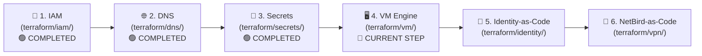

# Master Implementation & Migration Task Checklist (`mgmt/`)

**Legend**: 🔴 Not Started | 🟡 In Progress | 🟢 Completed | 🔵 Verified

---

## 🎯 Architecture Review & Design Status: 🟢 COMPLETED
- [x] **Decoupled Billing & Compute**: Permanent management plane (`ait-brainlab-mgmt`) strictly separate from GPU workloads (`brainlab-res-*`).
- [x] **AuthN vs. AuthZ Decoupling**: Google OAuth2 handles 100% of user authentication & lifecycles; LLDAP acts as a passwordless authorization/POSIX directory.
- [x] **Multi-Email Binding**: Single POSIX UID supports `@ait.asia`, `@ait.ac.th`, and personal alumni `@gmail.com` with zero data copying on TrueNAS.
- [x] **Zero Internal TLS Overhead**: Internal LDAP runs over NetBird WireGuard encrypted mesh tunnel (`ldap://` on port `:3890`).
- [x] **100% Stateless GitOps Control Plane**: All users, UIDs, VPN ACLs, and routing rules declared in Git; zero state stored on the VM.
- [x] **Modular Terraform Architecture**: 6 independent modules (`iam`, `dns`, `secrets`, `vm`, `identity`, `vpn`) backed by GCS remote state (`gs://ait-brainlab-mgmt-tfstate`).

---

## 📋 Modular Execution Sequence

---

### 👥 Phase 1: IAM & Project Governance (`mgmt/terraform/iam`)
| Task ID | Task Description | Target Identity | Status | Notes / Output |
| :--- | :--- | :--- | :---: | :--- |
| `1.1` | Run `terraform init` with GCS remote backend in `mgmt/terraform/iam/` | Akraradet | 🔵 | State locked in `gs://ait-brainlab-mgmt-tfstate/iam` |
| `1.2` | Apply `roles/owner` bindings for root project owners | Akraradet | 🔵 | `brainlab@ait.asia`, `st121413@ait.asia`, `akraradets@gmail.com` |
| `1.3` | Provision `brainlab-mgmt-terraform` service account with `roles/dns.admin` | Akraradet | 🔵 | Automation SA ready for CI/CD |

---

### 🌐 Phase 2: Cloud DNS Deployment (`mgmt/terraform/dns`)
| Task ID | Task Description | Target Identity | Status | Notes / Output |
| :--- | :--- | :--- | :---: | :--- |
| `2.1` | Run `terraform init` with GCS remote backend in `mgmt/terraform/dns/` | Akraradet | 🔵 | State locked in `gs://ait-brainlab-mgmt-tfstate/dns` |
| `2.2` | Adopt live GCP zones (`ait-brainlab`, `dpi-center`) and all 14 service records | Akraradet | 🔵 | 100% matched with zero drift |
| `2.3` | Apply Cloud DNS configuration with `lifecycle.prevent_destroy = true` | Akraradet | 🔵 | Nameservers permanently protected |
| `2.4` | Automated delegation health check via `bash check_delegation.sh` | Phue Pwint Thwe | 🔵 | `brain.cs.ait.ac.th` & `dpi.ait.ac.th` verified live! |

---

### 🔐 Phase 3: Secret Manager Deployment (`mgmt/terraform/secrets`)
| Task ID | Task Description | Target Identity | Status | Notes / Output |
| :--- | :--- | :--- | :---: | :--- |
| `3.1` | Run `terraform init` and `terraform apply` in `mgmt/terraform/secrets/` | Akraradet | 🔵 | Generated `lldap-jwt`, `lldap-admin-password`, `netbird-setup-key` |
| `3.2` | Automated zero-leakage secret verification via `bash check_secrets.sh` | Akraradet | 🔵 | All secrets verified live in Secret Manager |

---

### 🖥️ Phase 4: Disposable Management VM Engine (`mgmt/terraform/vm`)
| Task ID | Task Description | Target Identity | Status | Notes / Output |
| :--- | :--- | :--- | :---: | :--- |
| `4.1` | Provision Static IP & Firewall rules (HTTP/HTTPS/WireGuard/LDAP) via Terraform | Akraradet | 🔴 **CURRENT STEP** | Permanent Anycast IP |
| `4.2` | Launch `e2-micro` VM with Docker Compose (Traefik + LLDAP + NetBird) | Akraradet | 🔴 | < 300 MB RAM total |
| `4.3` | Verify automated Let's Encrypt SSL on `authen.brain.cs.ait.ac.th` & `netbird.brain.cs.ait.ac.th` | Akraradet | 🔴 | HTTPS operational |

---

### 👤 Phase 5: Identity-as-Code Directory (`mgmt/terraform/identity`)
| Task ID | Task Description | Target Identity | Status | Notes / Output |
| :--- | :--- | :--- | :---: | :--- |
| `5.1` | Export existing user accounts, UIDs, and GIDs from on-premise OpenLDAP | Phue Pwint Thwe | 🔴 | Dump posixAccount attributes |
| `5.2` | Declare users, numeric UIDs, and email bindings in `users.tf` | Akraradet / Phue Pwint Thwe | 🔴 | Single source of truth in Git |
| `5.3` | Apply `bpg/lldap` Terraform module to seed LLDAP directory | Akraradet | 🔴 | Automated 3-second re-hydration |
| `5.4` | Update `/etc/sssd/sssd.conf` on compute nodes & NAS (`cairo`) to point to `lldap:3890` | Phue Pwint Thwe | 🔴 | Connect over NetBird WireGuard mesh |
| `5.5` | Test `getent passwd <user>` and verify NFS home directory read/write access | Phue Pwint Thwe | 🔴 | Test SSH & file access on `cairo` |

---

### 📡 Phase 6: NetBird-as-Code Mesh Network (`mgmt/terraform/vpn`)
| Task ID | Task Description | Target Identity | Status | Notes / Output |
| :--- | :--- | :--- | :---: | :--- |
| `6.1` | Declare device groups (`servers`, `students`, `admins`) and Zero-Trust ACLs in `network.tf` | Akraradet | 🔴 | Versioned in Git |
| `6.2` | Enroll on-prem servers (`la`, `tokyo`, `cairo`) using Secret Manager key | Phue Pwint Thwe | 🔴 | Connect physical nodes |
| `6.3` | Verify peer-to-peer ping across mesh network | Whole Team | 🔴 | Direct WireGuard P2P |

---

### 🚀 Phase 7: JupyterHub Google OIDC Integration
| Task ID | Task Description | Target Identity | Status | Notes / Output |
| :--- | :--- | :--- | :---: | :--- |
| `7.1` | Create OAuth2 Client ID & Secret in `GCP Console > APIs & Services` | Akraradet | 🔴 | Web application credential |
| `7.2` | Configure JupyterHub `oauthenticator.google` with email whitelist & LLDAP spawner hook | Akraradet | 🔴 | `@ait.asia`, `@ait.ac.th`, and approved `@gmail.com` |
| `7.3` | Test "Sign in with Google" flow for JupyterHub users | Whole Team | 🔴 | 1-click login + correct NFS mounts |
