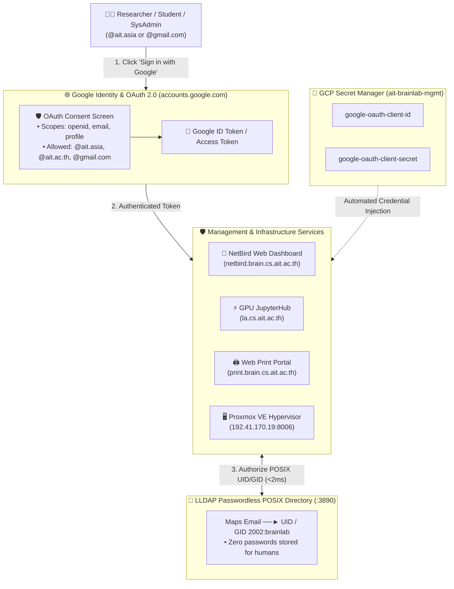

# 🔑 Google OAuth2 / OIDC Setup Guide (`mgmt/oauth_setup.md`)

> **The Permanent Identity Provider**: Google OAuth2 handles 100% of human authentication, passwords, and 2FA across all AIT Brainlab services (**NetBird Mesh VPN**, **GPU JupyterHub**, **Remote Web Print Portal**, and **Proxmox VE Hypervisor Web GUI**) using `@ait.asia`, `@ait.ac.th`, and approved alumni `@gmail.com` accounts.

---

## 🛡️ Why This is a One-Time Console Step (Phase 0 Foundation)

Google Cloud Platform enforces a strict security boundary: **Generic OAuth 2.0 Web Client IDs cannot be created via Terraform or API**. 

Google intentionally requires a human project owner to approve the **OAuth Consent Screen** (branding, privacy policy, contact email) in the Google Cloud Console. 

Just like creating the initial GCP Project or State Bucket, this is a **One-Time Foundation Boundary (Done Once Forever)**. Once created, the credentials are saved into **GCP Secret Manager**, and all subsequent deployments across Terraform, NetBird, JupyterHub, Web Print, and Proxmox VE read them 100% automatically via code or configuration.

---

## 🏗️ Master Single Sign-On Architecture



---

## 📋 Step-by-Step Operator Runbook (Click-by-Click)

### Step 1: Configure OAuth Consent Screen (If First Time)
1. Open the [**GCP OAuth Consent Screen**](https://console.cloud.google.com/apis/credentials/consent?project=ait-brainlab-mgmt).
2. Select **User Type**: **External** *(allows both institutional `@ait.asia` accounts and `@gmail.com` alumni)*.
3. Fill in the required fields:
   - **App Name**: `AIT Brainlab`
   - **User Support Email**: `brainlab@ait.asia` (or project owner email)
   - **Developer Contact Information**: `brainlab@ait.asia`
4. Under **Scopes**, ensure the following are selected:
   - `.../auth/userinfo.email`
   - `.../auth/userinfo.profile`
   - `openid`
5. Click **Save and Continue** until completed.

---

### Step 2: Create the OAuth 2.0 Web Client ID
1. Navigate to the [**GCP Credentials Page**](https://console.cloud.google.com/apis/credentials?project=ait-brainlab-mgmt).
2. Click **`+ CREATE CREDENTIALS`** $\rightarrow$ **OAuth client ID**.
3. Set **Application type**: **Web application**.
4. Set **Name**: `AIT Brainlab SSO (NetBird, JupyterHub, Web Print, Proxmox)`.

5. **Authorized JavaScript Origins**:
   ```text
   https://netbird.brain.cs.ait.ac.th
   https://ldap.brain.cs.ait.ac.th
   https://la.cs.ait.ac.th
   https://print.brain.cs.ait.ac.th
   https://192.41.170.19:8006
   ```

6. **Authorized Redirect URIs**:
   ```text
   https://netbird.brain.cs.ait.ac.th
   https://netbird.brain.cs.ait.ac.th/auth
   https://netbird.brain.cs.ait.ac.th/silent-auth
   http://localhost:53000
   https://la.cs.ait.ac.th/hub/oauth_callback
   https://print.brain.cs.ait.ac.th/oauth2/callback
   https://192.41.170.19:8006/oauth2/callback
   ```

7. Click **CREATE**.

---

### Step 3: Store Client ID & Secret in GCP Secret Manager
```bash
# 1. Store Client ID
echo -n "YOUR_CLIENT_ID.apps.googleusercontent.com" | \
  gcloud secrets versions add google-oauth-client-id --data-file=- --project=ait-brainlab-mgmt

# 2. Store Client Secret
echo -n "GOCSPX-YOUR_CLIENT_SECRET" | \
  gcloud secrets versions add google-oauth-client-secret --data-file=- --project=ait-brainlab-mgmt
```

---

## 🔍 Service Integration Matrix

| Service | Credential Injection Path | User Experience |
| :--- | :--- | :--- |
| **📡 NetBird Web Dashboard** | Read from Secret Manager $\rightarrow$ `docker-compose.yml` (`AUTH_CLIENT_ID`) | 1-Click Google Sign-in on `https://netbird.brain.cs.ait.ac.th` |
| **⚡ JupyterHub** | Read from Secret Manager $\rightarrow$ `jupyterhub_config.py` (`OAuthenticator`) | 1-Click login on `https://la.cs.ait.ac.th` spawning user GPU notebook |
| **🖨️ Web Print Portal** | Read from Secret Manager $\rightarrow$ OAuth2 Proxy | Protects `https://print.brain.cs.ait.ac.th` requiring Google login before PDF upload |
| **🖥️ Proxmox VE Hypervisor** | Configured via `pveum realm add google --type openid ...` | Select **Google OpenID** on Proxmox login screen (`https://192.41.170.19:8006`). Maps `@ait.asia` SysAdmins to `Administrator`. |

---

### 🖥️ Proxmox VE OIDC Realm Configuration Command Example

Run on the Proxmox VE host (`192.41.170.19`):

```bash
pveum realm add google --type openid \
  --issuer-url https://accounts.google.com \
  --client-id "<CLIENT_ID>.apps.googleusercontent.com" \
  --client-key "<CLIENT_SECRET>" \
  --username-claim email \
  --autocreate 1 \
  --default 0 \
  --comment "Google OAuth2 SSO"

# Assign SysAdmin permission to specific Google email
pveum acl modify / --user "akraradet@ait.asia@google" --role Administrator
```

---

## 🛠️ Adding New Services or Rotating URIs

When a new web application or staging domain is added in the future:
1. Open the [**GCP Credentials Page**](https://console.cloud.google.com/apis/credentials?project=ait-brainlab-mgmt).
2. Click the edit icon on **AIT Brainlab SSO**.
3. Add the new origin and redirect URI.
4. Click **Save** (updates take effect globally within 60 seconds).
