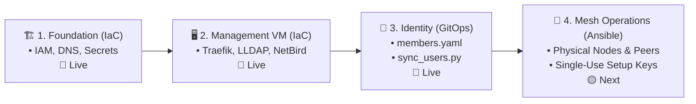

# Modular Infrastructure & Control Plane: `ait-brainlab-mgmt`

To eliminate complexity, minimize risk, and achieve **100% Stateless GitOps**, the management plane infrastructure is cleanly decoupled into Terraform Day 0 infrastructure, GitOps Identity, and Ansible Day 1 mesh operations.

---

## 🛠️ Phase 0: One-Time Foundation Prerequisites (Done Once Forever)

The following steps are performed **manually once** when setting up the GCP project:

1. **GCP Project**: `ait-brainlab-mgmt` created.
2. **GCP Billing**: Permanent billing account linked.
3. **GCS State Bucket**: Created with versioning enabled:
   ```bash
   gcloud storage buckets create gs://ait-brainlab-mgmt-tfstate \
     --project=ait-brainlab-mgmt \
     --location=asia-southeast1 \
     --uniform-bucket-level-access

   gcloud storage buckets update gs://ait-brainlab-mgmt-tfstate --versioning
   ```
4. **Google OAuth 2.0 Web Client ID**: Created in GCP Console (APIs & Services > Credentials) with authorized origins & redirect URIs for NetBird, JupyterHub, and Web Print. Complete SOP documented in [`services/identity/oauth/README.md`](../../services/identity/oauth/README.md).

---

## 🧭 Clean Decoupled Lifecycle Sequence



| Sequence | Layer | Technology | Purpose | State / Source | Status |
| :---: | :--- | :--- | :--- | :--- | :---: |
| **1** | [**`foundation/`**](foundation/README.md) | Terraform | Root IAM owners, authoritative Cloud DNS zones (`brain.cs.ait.ac.th`), and bootstrap secrets (`lldap-jwt`, `lldap-admin-password`). | `gs://.../foundation` | 🔵 **LIVE** |
| **2** | [**`vm/`**](vm/README.md) | Terraform | Disposable `e2-micro` VM with dynamic public IP, VPC firewall, automated Let's Encrypt SSL, and 5 control plane containers. | `gs://.../vm` | 🔵 **LIVE** |
| **3** | [**`identity/`**](../identity/README.md) | GitOps (Python) | Single source of truth for lab members in [`members.yaml`](../identity/members.yaml). POSIX numeric UIDs/GIDs and Multi-Email Bindings. | Git + LLDAP SQLite | 🔵 **LIVE** |
| **4** | [**`ansible/`**](../ansible/) | Ansible | Day 1 physical server enrollment (`la`, `tokyo`, `cairo`), SSSD client configuration, and ephemeral mesh keys. | Ansible Vault / Secrets | 🟡 **STAGED** |

---

## 🔐 Service Account Architecture for LLDAP Queries (`ldapservice`)

### The Chicken-and-Egg Problem (Why NOT in Terraform?)
In earlier architectures, attempting to manage LLDAP users or service accounts via Terraform (`tasansga/lldap` provider) caused severe circular dependencies:
- Terraform cannot execute API calls against `https://ldap.brain.cs.ait.ac.th` until the VM, Traefik proxy, and LLDAP container are fully provisioned and healthy.
- If the VM was destroyed or stopped, `terraform plan` would crash trying to reach a non-existent API.
- Therefore, **all user and service account creation is strictly decoupled from Terraform** into post-deployment GitOps (`mgmt/identity/`).

### How `ldapservice` is Managed
1. **Creation**: Provisioned via [`mgmt/identity/sync_users.py`](../identity/sync_users.py) through the native LLDAP GraphQL API.
2. **Role & Privileges**: Assigned to the built-in system group **`lldap_strict_readonly`**.
   - ✅ Can query all users, POSIX UIDs, GIDs, emails, and groups.
   - ❌ Cannot modify, add, or delete any records.
3. **Secret Storage**: A random 32-character password is generated and stored in **GCP Secret Manager** as `lldap-readonly-password`.
4. **Consumption by Downstream Systems**:
   - **Linux SSSD** on physical compute nodes (`la`, `tokyo`, `cairo`): Reads `lldap-readonly-password` from Secret Manager during Ansible deployment and binds to `ldap://ldap.brain.cs.ait.ac.th:3890`.
   - **TrueNAS NFS**: Authenticates directory searches over NetBird WireGuard mesh.
   - **JupyterHub**: Queries user POSIX attributes in <2ms before spawning user notebook containers.

---

## 🛡️ Why This Architecture is 100% Stateless & Self-Healing

```
┌────────────────────────────────────────────────────────────────────────────────────────┐
│               AIT BRAINLAB 100% STATELESS GITOPS ARCHITECTURE                          │
├────────────────────────────────────────────────────────────────────────────────────────┤
│ 1. 👤 Identity & UIDs       ──► Stored in Git (`mgmt/identity/members.yaml`).          │
│ 2. 🔐 Read-Only Bind Acct   ──► Stored in Secret Manager (`lldap-readonly-password`).  │
│ 3. 🌐 Domain Resolution     ──► Stored in Git (`foundation/dns.tf`) & Google Anycast.  │
│ 4. 👥 Access Governance     ──► Stored in Git (`foundation/iam.tf`) & GCP IAM.         │
│ 5. 🔒 SSL Certificates      ──► Self-healing: Traefik auto-renews Let's Encrypt SSL.   │
│ 6. 🖥️ VM Compute Engine     ──► 100% Disposable Cattle (`e2-micro`). Zero state stored. │
│ 7. 💾 SQLite State          ──► Auto-snapshotted to GCS every 6h and on shutdown.      │
│ 8. 🔬 User Research Data    ──► Preserved on physical TrueNAS NFS (`/mnt/pool-1/home`). │
└────────────────────────────────────────────────────────────────────────────────────────┘
```
