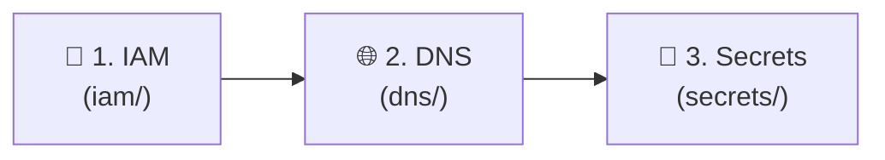

# Modular Terraform Infrastructure: `ait-brainlab-mgmt`

To eliminate complexity, minimize risk, and allow safe multi-admin collaboration, the management plane infrastructure is divided into **3 independent, bite-sized modules** backed by a central **Google Cloud Storage (GCS) Remote State Backend**.

---

## 🛠️ Phase 0: One-Time Foundation Prerequisites (Done Once Forever)

The following steps are performed **manually once** when setting up the GCP project. Future SysAdmins and CI/CD pipelines will **skip this step**:

1. **GCP Project**: `ait-brainlab-mgmt` created.
2. **GCP Billing**: Permanent billing account linked.
3. **GCS State Bucket**: Created with versioning enabled:
   ```bash
   gcloud storage buckets create gs://ait-brainlab-mgmt-tfstate \
     --project=ait-brainlab-mgmt \
     --location=asia-southeast1 \
     --uniform-bucket-level-access

   gcloud storage buckets update gs://ait-brainlab-mgmt-tfstate --versioning
   ```

---

## 🧭 Recommended Deployment Sequence

Following enterprise cloud best practices, **IAM Governance is established first** before provisioning networking or secrets:



| Sequence | Module | Purpose | State Prefix | Guide |
| :---: | :--- | :--- | :---: | :--- |
| **1** | [**`iam/`**](iam/README.md) | **Governance First**: Locks down Project Owners (`brainlab`, `st121413`, `akraradets`) and provisions the automation service account (`roles/dns.admin`). | `iam` | [`iam/README.md`](iam/README.md) |
| **2** | [**`dns/`**](dns/README.md) | **Network & Routing**: Authoritative Cloud DNS zones (`brain.cs.ait.ac.th`, `dpi.ait.ac.th`) and live service records. | `dns` | [`dns/README.md`](dns/README.md) |
| **3** | [**`secrets/`**](secrets/README.md) | **Credentials & Keys**: Secret Manager storage for `lldap-jwt-secret`, `lldap-admin-password`, and `netbird-onprem-setup-key`. | `secrets` | [`secrets/README.md`](secrets/README.md) |

---

> 📖 **Note**: Detailed step-by-step deployment runbooks, import scripts, and verification commands are located inside each service folder's dedicated `README.md`.
