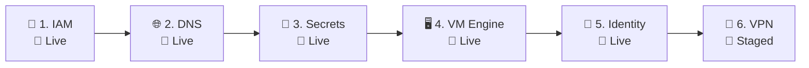

# Modular Terraform Infrastructure: `ait-brainlab-mgmt`

To eliminate complexity, minimize risk, and achieve **100% Stateless GitOps**, the management plane infrastructure is divided into **6 independent, bite-sized modules** backed by a central **Google Cloud Storage (GCS) Remote State Backend** (`gs://ait-brainlab-mgmt-tfstate`).

---

## 🛠️ Phase 0: One-Time Foundation Prerequisites (Done Once Forever)

The following steps are performed **manually once** when setting up the GCP project. Future SysAdmins and CI/CD pipelines will **skip this step**:

1. **GCP Project**: `ait-brainlab-mgmt` created.
2. **GCP Billing**: Permanent billing account linked.
3. **GCS State Bucket**: Created with versioning enabled:
   ```bash
   gcloud storage buckets create gs://ait-brainlab-mgmt-tfstate \
     --project=ait-brainlab-mgmt \
     --location=asia-southeast1 \
     --uniform-bucket-level-access

   gcloud storage buckets update gs://ait-brainlab-mgmt-tfstate --versioning
   ```
4. **Google OAuth 2.0 Web Client ID**: Created in GCP Console (APIs & Services > Credentials) with authorized origins & redirect URIs for NetBird, JupyterHub, and Web Print. Complete SOP documented in [`services/identity/oauth/README.md`](../../services/identity/oauth/README.md).

---

## 🧭 The 6-Stage Modular Deployment Sequence



| Sequence | Module | Purpose | GCS Prefix | Status | Guide |
| :---: | :--- | :--- | :---: | :---: | :--- |
| **1** | [**`iam/`**](iam/README.md) | **Governance First**: Root Project Owners (`brainlab`, `st121413`, `akraradets`) & `brainlab-mgmt-terraform` service account. | `iam` | 🔵 **VERIFIED** | [`iam/README.md`](iam/README.md) |
| **2** | [**`dns/`**](dns/README.md) | **Network & Routing**: Authoritative Cloud DNS zones (`brain.cs.ait.ac.th`, `dpi.ait.ac.th`) & all 14 service records. | `dns` | 🔵 **VERIFIED** | [`dns/README.md`](dns/README.md) |
| **3** | [**`secrets/`**](secrets/README.md) | **Credentials & Keys**: Secret Manager storage for VM bootstrap credentials (`lldap-jwt`, `lldap-admin-password`). | `secrets` | 🔵 **VERIFIED** | [`secrets/README.md`](secrets/README.md) |
| **4** | [**`vm/`**](vm/README.md) | **Disposable Compute Engine**: `e2-micro` VM with Static IP running Traefik, LLDAP, and NetBird via Docker Compose. | `vm` | 🔵 **VERIFIED** | [`vm/README.md`](vm/README.md) |
| **5** | [**`identity/`**](identity/README.md) | **Identity-as-Code**: Declarative LLDAP users, Unix numeric UIDs/GIDs, and Multi-Email Bindings. | `identity` | 🔵 **VERIFIED** | [`identity/README.md`](identity/README.md) |
| **6** | [**`vpn/`**](vpn/README.md) | **NetBird-as-Code**: Declarative device groups (`servers`, `sysadmin-devices`), setup keys, Zero-Trust ACLs, and Auto-Enrolled Peer #1 (`100.66.104.104`). | `vpn` | 🔵 **VERIFIED** | [`vpn/README.md`](vpn/README.md) |

---

## 🛡️ Why This Architecture is 100% Stateless & Self-Healing

```
┌────────────────────────────────────────────────────────────────────────────────────────┐
│               AIT BRAINLAB 100% STATELESS GITOPS ARCHITECTURE                          │
├────────────────────────────────────────────────────────────────────────────────────────┤
│ 1. 👤 Identity & UIDs       ──► Stored in Git (`identity/*.tf`). No passwords in LLDAP.│
│ 2. 📡 VPN Groups & ACLs     ──► Stored in Git (`vpn/*.tf`). Rebuilds in 5 seconds.     │
│ 3. 🌐 Domain Resolution     ──► Stored in Git (`dns/*.tf`) & Google Anycast DNS.       │
│ 4. 👥 Access Governance     ──► Stored in Git (`iam/*.tf`) & GCP IAM.                  │
│ 5. 🔐 Secrets & Tokens      ──► Stored in Secret Manager (`secrets/*.tf`).             │
│ 6. 🔒 SSL Certificates      ──► Self-healing: Traefik auto-renews Let's Encrypt SSL.   │
│ 7. 🖥️ VM Compute Engine     ──► 100% Disposable Cattle (`e2-micro`). Zero state stored. │
│ 8. 💾 Research Data         ──► Preserved on physical TrueNAS NFS (`/mnt/HDD/home`).   │
└────────────────────────────────────────────────────────────────────────────────────────┘
```
