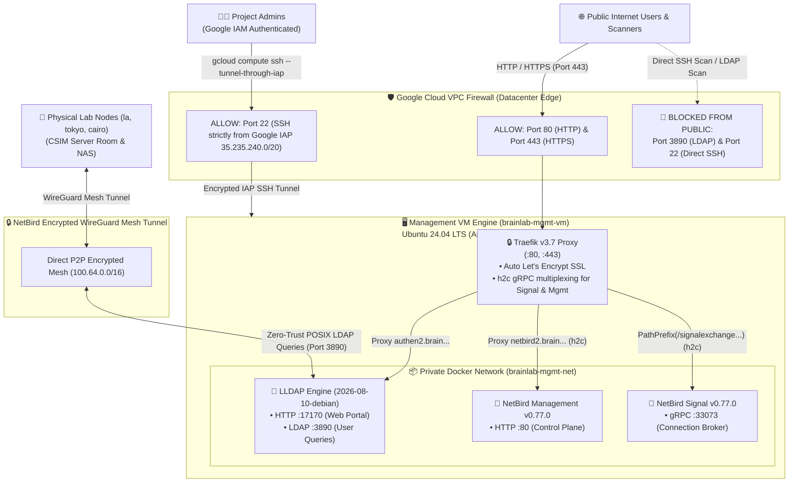

# Sequence 4: Disposable Management VM Engine (`mgmt/terraform/vm`)

## 📌 Overview & Purpose
This is **Sequence 4 of 6** in the management plane infrastructure.

This module provisions the **100% Stateless Management VM** running on Google Compute Engine (`e2-micro`, Ubuntu 24.04 LTS with `Asia/Bangkok` timezone). It automatically installs Docker, configures automated security patching, mounts our Traefik/LLDAP/NetBird stack, and attaches a permanent Static External Public IP.

The state is permanently synchronized in Google Cloud Storage (`gs://ait-brainlab-mgmt-tfstate/vm/default.tfstate`).

---

## 📦 Pinned Production Container Stack

All container images are strictly pinned to verified, deterministic versions:

| Service | Container Image | Version Tag | Port | Purpose |
| :--- | :--- | :---: | :---: | :--- |
| **🔒 Traefik** | `traefik:v3.7` | `v3.7` | `:80`, `:443` | Reverse proxy, automatic Let's Encrypt SSL & HTTP/2 |
| **👤 LLDAP** | `lldap/lldap:2026-08-10-debian` | `2026-08-10-debian` | `:17170`, `:3890` | Lightweight POSIX directory & passwordless mappings |
| **📡 NetBird Signal** | `netbirdio/signal:0.77.0` | `0.77.0` | `:33073` (UDP/TCP) | WireGuard peer signal & WebRTC connection broker |
| **📡 NetBird Management** | `netbirdio/management:0.77.0` | `0.77.0` | `:80` | Central mesh VPN policy & control plane |

---

## 🏗️ Architecture & Network Security Diagram



---

## 🌐 Access URLs & Service Endpoints

### 🧪 Staging Endpoints (For Safe Side-by-Side Testing)
| Service | Staging URL | Purpose |
| :--- | :--- | :--- |
| **👤 LLDAP Web Portal** | `https://authen2.brain.cs.ait.ac.th` | User directory administration & passwordless mappings |
| **📡 NetBird Dashboard** | `https://netbird2.brain.cs.ait.ac.th` | Mesh VPN control plane & device peer management |

---

### 🚀 Production Endpoints (Active Post-Cutover)
| Service | Production URL | Target Host |
| :--- | :--- | :--- |
| **👤 LLDAP Web Portal** | `https://authen.brain.cs.ait.ac.th` | Management Control Plane (Post-Cutover) |
| **📡 NetBird Dashboard** | `https://netbird.brain.cs.ait.ac.th` | Management Control Plane (Post-Cutover) |

---

### 🔒 Internal Zero-Trust Endpoints (NetBird Mesh Only)
| Service | Endpoint | Protocol | Purpose |
| :--- | :--- | :---: | :--- |
| **Internal POSIX LDAP** | `ldap://<netbird-mgmt-ip>:3890` | LDAP | Linux SSSD & TrueNAS NFS user lookups |

---

## 🛡️ Zero-Trust Security & Port Matrix

| Port / Protocol | Firewall Rule Name | Public Access | Purpose |
| :--- | :--- | :---: | :--- |
| **`80` / TCP** | `brainlab-mgmt-allow-web` | 🌐 Public | • Let's Encrypt automated SSL validation (ACME)<br>• Auto-redirects `http://` $\rightarrow$ `https://` |
| **`443` / TCP** | `brainlab-mgmt-allow-web` | 🌐 Public | • Secure HTTPS access to `authen2` and `netbird2` web portals |
| **`33073` / UDP & TCP** | `brainlab-mgmt-allow-netbird` | 🌐 Public | • NetBird WireGuard peer connection broker and signal negotiation |
| **`22` / TCP (SSH)** | `brainlab-mgmt-allow-iap-ssh` | 🔒 **Google IAP Only (`35.235.240.0/20`)** | • **Zero Public Exposure**: Only authenticated Google IAM admins can tunnel in! |
| **`3890` / TCP (LDAP)** | *(No Public Rule)* | 🔒 **NetBird Mesh Only** | • **Zero-Trust**: Only accessible to authenticated NetBird WireGuard mesh peers! |

---

## 💻 How to SSH into the VM (Google IAP Tunnel)

Because Port 22 is completely closed to the public internet, connect securely via Google Identity-Aware Proxy:

```bash
gcloud compute ssh brainlab-mgmt-vm \
  --zone=asia-southeast1-a \
  --project=ait-brainlab-mgmt \
  --tunnel-through-iap
```

---

## 🛠️ Operational Helper Scripts

We provide three pre-configured zero-leakage automation scripts:

### 1. 📺 Live Bootstrap & Log Monitor (`monitor_vm_logs.sh`)
Stream live boot logs, startup script progress, and container outputs directly from the terminal:
```bash
# Interactive menu:
bash monitor_vm_logs.sh

# Or direct modes:
bash monitor_vm_logs.sh 1  # Live startup-script logs (google-startup-scripts.service)
bash monitor_vm_logs.sh 2  # Live Docker Compose logs (Traefik, LLDAP, NetBird)
bash monitor_vm_logs.sh 3  # Serial Console boot logs (Kernel / Hardware)
bash monitor_vm_logs.sh 4  # Container health snapshot (docker ps)
```

### 2. 🔍 Automated Endpoint Health Check (`check_vm_health.sh`)
Verify that both HTTPS staging portals return HTTP 200/302 and Let's Encrypt certificates are active:
```bash
bash check_vm_health.sh
```

### 3. 🛰️ Automated Terraform Waiter (`wait_for_bootstrap.sh`)
Invoked automatically by `terraform apply` to follow the VM's startup script live via Google IAP and confirm container health before finishing.

---

## 🚀 Step-by-Step Deployment Tutorial

### Step 1: Initialize Configuration & Remote State (Task 4.1)
```bash
cd mgmt/terraform/vm
cp terraform.tfvars.example terraform.tfvars
terraform init
```

---

### Step 2: 1-Click Deploy (VM + Static IP + DNS Ingress) (Task 4.2)
```bash
terraform plan
terraform apply
```
Type `yes` when prompted. 

Terraform will automatically:
1. Reserve your permanent Static Public IP (`34.143.234.182`) with `lifecycle { prevent_destroy = true }`.
2. Create `authen2.brain.cs.ait.ac.th` and `netbird2.brain.cs.ait.ac.th` in Cloud DNS.
3. Configure the Zero-Trust Firewall (Port 22 IAP-only, Port 3890 Mesh-only).
4. Launch the `e2-micro` Ubuntu 24.04 LTS VM (Timezone: `Asia/Bangkok`), stream the bootstrap progress live, and start the Traefik/LLDAP/NetBird Docker stack.

---

### Step 3: Automated Health Check (Task 4.3)
Traefik will automatically negotiate Let's Encrypt SSL certificates. Run:

```bash
bash check_vm_health.sh
```

---

## 🛠️ Day-2 Operations & Lifecycle Management

### 1. Permanent IP Safety (`prevent_destroy = true`)
The Static Public IP (`google_compute_address.mgmt_ip`) has `lifecycle { prevent_destroy = true }`. Running an accidental `terraform destroy` will be **hard-blocked by Terraform**, preventing loss of the permanent IP address.

---

### 2. Disposable Rebuild ("100% Cattle")
To completely destroy and rebuild the VM from scratch while keeping the permanent IP:
```bash
terraform apply -replace=google_compute_instance.mgmt_vm
```
Terraform will destroy the old VM, spin up a brand-new instance, pull fresh images, and restore the entire control tower in **under 90 seconds**!

---

### 3. Standby Mode / Cold-Start ($0 Compute Cost)
If you want to tear down the VM to incur $0 compute cost while keeping the permanent IP and DNS:
```bash
# Destroy only the VM:
terraform destroy -target=google_compute_instance.mgmt_vm

# Bring it back anytime:
terraform apply
```

---

### 4. How to Resize the VM (Vertical Scaling)
If you ever want to upgrade from `e2-micro` (1 GB RAM) to `e2-small` (2 GB RAM):
1. Open [`main.tf`](main.tf) or `terraform.tfvars` and edit:
   ```hcl
   machine_type = "e2-small"
   ```
2. Run `terraform apply`.  
   *(GCE stops the VM, resizes CPU/RAM, and reboots in ~20s with ZERO IP change and ZERO data loss).*

---

## ➡️ Next Step: Sequence 5 (Identity-as-Code)
Now that the LLDAP engine is running on the VM, proceed to **Sequence 5: Seeding Users, UIDs, and Multi-Email Bindings**:
👉 [**Continue to `mgmt/terraform/identity/README.md`**](../identity/README.md)
