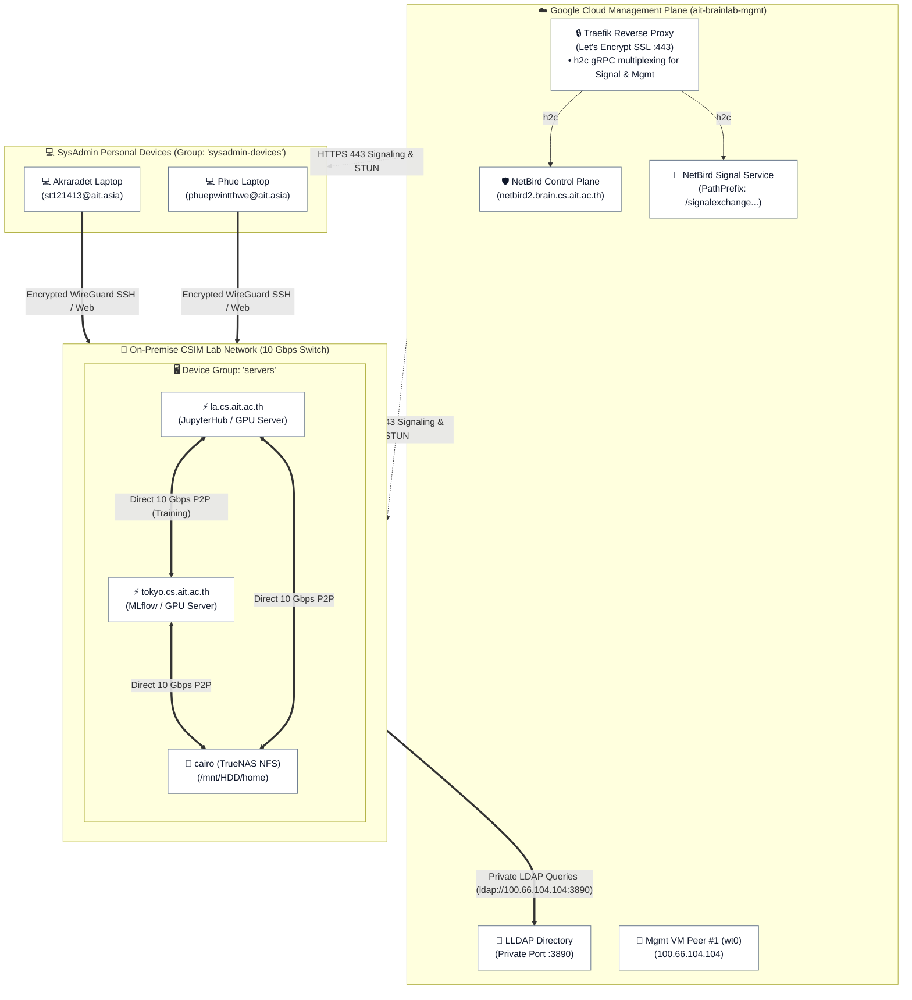
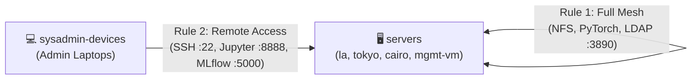
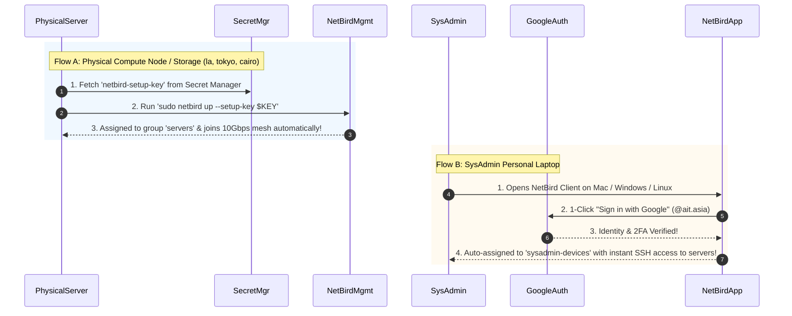

# 📡 NetBird-as-Code Mesh VPN (`mgmt/terraform/vpn`)

> **Single-Purpose WireGuard Mesh Network**: Connects the Cloud Management VM, on-premise GPU servers (`la`, `tokyo`), and TrueNAS storage (`cairo`) into a private, high-speed, encrypted network with **Zero Public Port Exposure**.

> [!IMPORTANT]
> **STRICT PREREQUISITE GATEWAY (Sequence 6 of 6)**:
> This module is strictly the **final capstone sequence**. It MUST only be deployed **AFTER**:
> 1. Sequence 1 (`iam/`), Sequence 2 (`dns/`), and Sequence 3 (`secrets/`) are live.
> 2. Sequence 4 (`vm/`) is running with Traefik and NetBird containers healthy.
> 3. Sequence 5 (`identity/`) has seeded the LLDAP directory.
>
> *(Never attempt to deploy `vpn/` on an empty project without Sequences 1–5).*

---

## 🏗️ 1. Complete Architecture & Topology Diagram



---

## 💡 2. Architectural Design Principles

### ⚡ Direct Peer-to-Peer (P2P) Data Plane
- **10 Gbps LAN Speed**: NetBird uses ICE/STUN signaling to negotiate **direct local connections** between physical servers inside the CSIM lab.
- **Zero Cloud Bandwidth Costs**: 100% of large training datasets, model checkpoints, and NFS file transfers flow across the local CSIM switch. **Heavy data NEVER travels through the Cloud VM**.

### 🔒 Zero Public Port Exposure (Hidden LDAP)
- LLDAP on port `:3890` is **completely blocked** on the GCP Cloud Firewall.
- Physical compute nodes (`la`, `tokyo`) and TrueNAS query LLDAP **strictly over the encrypted WireGuard mesh** (`ldap://100.66.104.104:3890`).

### 🛡️ Pure GitOps Governance (Single Master Debug Console)
- **100% Declarative**: All device groups, setup keys, and Zero-Trust firewall rules are versioned in Terraform.
- **Zero UI State Drift**: Individual SysAdmins (`st121413`, `phue`) log in with `role = "user"` and are auto-assigned to group `sysadmin-devices`. Only **`brainlab@ait.asia`** has Web Dashboard access for emergency troubleshooting.

---

## 👥 3. Device Groups & Zero-Trust Firewall Matrix



### The Groups ([`groups.tf`](groups.tf)) & Accounts ([`users.tf`](users.tf))
| Identity / Group | Type | Function & Access |
| :--- | :---: | :--- |
| **`brainlab@ait.asia`** | `admin` User | **Master Debug Console**: The single account with Web Dashboard access for live signal graph inspection. |
| **SysAdmin Laptops** | `user` Account | **Zero Web Drift**: `st121413`, `akraradets`, `phue` join group `sysadmin-devices` with full SSH access. |
| **`servers`** | Device Group | Cloud VM (`mgmt`), GPU nodes (`la`, `tokyo`), TrueNAS (`cairo`) auto-enrolled via Secret Manager key. |
| **`sysadmin-devices`** | Device Group | Auto-assigned to SysAdmin devices granting full network reachability to `servers`. |

### The Policies ([`acls.tf`](acls.tf))
| # | Policy Name | Traffic Path | Allowed Protocols | Purpose |
| :---: | :--- | :--- | :---: | :--- |
| **1** | **Servers Full Mesh** | `servers` $\longleftrightarrow$ `servers` | `All` (P2P WireGuard) | NFS file sharing, distributed PyTorch, and LLDAP `:3890` lookups |
| **2** | **SysAdmin Access** | `sysadmin-devices` $\longrightarrow$ `servers` | `All` (WireGuard) | Full SSH, JupyterHub, MLflow, and management access from home |

---

## 🔄 4. Node Enrollment Lifecycle



---

## 📁 5. Terraform Module Structure

```
mgmt/terraform/vpn/
├── main.tf          # NetBird provider (netbirdio/netbird) & GCS state backend
├── users.tf         # 👤 Single master debug admin + SysAdmin user accounts
├── groups.tf        # 👥 Device groups ("servers", "sysadmin-devices")
├── acls.tf          # 🛡️ Zero-Trust policies ("servers_mesh", "sysadmin_access")
├── setup_keys.tf    # 🔑 Reusable 365-day enrollment key for servers -> Secret Manager
├── peer.tf          # 📡 Automated Peer #1 Enrollment on Management VM (Upgrade-Aware)
├── variables.tf     # Input variables (project_id, netbird_management_url, netbird_client_version)
├── outputs.tf       # Module outputs (Group IDs, Policy IDs, Key IDs, Secret Manager ID)
└── README.md        # This comprehensive design document & runbook
```

---

## 🚀 6. Step-by-Step Operator Runbook

### Step 1: Apply Terraform Module (Auto-Enrolls Peer #1)
```bash
cd mgmt/terraform/vpn
terraform init
terraform plan
terraform apply
```
> [!TIP]
> **Automated Peer #1**: `terraform apply` automatically provisions the `netbird-client` container on the Management VM, links it to `netbird-setup-key`, and verifies that the `wt0` interface comes up live (`100.66.104.104`)!

---

### Step 2: Enroll Physical Servers (`la`, `tokyo`, `cairo`)
On each physical server in the CSIM lab:

```bash
# 1. Fetch enrollment key from Secret Manager
SETUP_KEY=$(gcloud secrets versions access latest --secret="netbird-setup-key" --project="ait-brainlab-mgmt")

# 2. Join the NetBird mesh
sudo netbird up --management-url https://netbird2.brain.cs.ait.ac.th --setup-key "$SETUP_KEY"

# 3. Verify connection
netbird status
```

---

### Step 3: Connect SysAdmin Laptops
1. Download the NetBird app from [netbird.io/install](https://netbird.io/install).
2. Open Settings $\rightarrow$ Set Management URL to `https://netbird2.brain.cs.ait.ac.th`.
3. Click **Connect** and log in with your Google Account (`@ait.asia`).
4. *Your laptop is automatically placed in `sysadmin-devices` with full access to all servers.*

---

### Step 4: Verify Mesh Connectivity
From any server (e.g. `tokyo`), test LDAP lookup over the private mesh:

```bash
# Query LLDAP on Cloud VM over NetBird IP (Port 3890)
ldapsearch -x -H ldap://100.66.104.104:3890 -b "dc=brain,dc=cs,dc=ait,dc=ac,dc=th" "(uid=st121413)"
```

---

## 🔮 7. Future Expansion Patterns

### Pattern A: Adding a Project Subnet (e.g. Driving License CCTV cameras)
When a project requires connecting to isolated hardware (like CCTV IP cameras on `192.168.10.0/24`):
1. In [`groups.tf`](groups.tf), declare `resource "netbird_group" "driving_license" { name = "driving-license" }`.
2. Add a `netbird_route` resource routing `192.168.10.0/24` through the Lab Gateway PC.
3. Only researchers in `driving-license` will receive the camera route!

### Pattern B: Adding a 2nd Cluster (e.g. Cloud GPUs)
1. In [`groups.tf`](groups.tf), declare `resource "netbird_group" "cloud_servers" { name = "cloud-servers" }`.
2. In [`acls.tf`](acls.tf), permit `cloud-servers` to talk to local cloud storage and query `servers` on port `:3890` (LDAP).

---

## 🛠️ NetBird CLI Quick Reference

| Command | Description |
| :--- | :--- |
| `netbird status` | Display mesh IP, connection status, and management server endpoint. |
| `netbird status -d` | Display detailed peer connection list, WireGuard ICE status, and ping latencies. |
| `netbird up` | Connect node to the NetBird mesh. |
| `netbird down` | Disconnect node from the NetBird mesh. |
