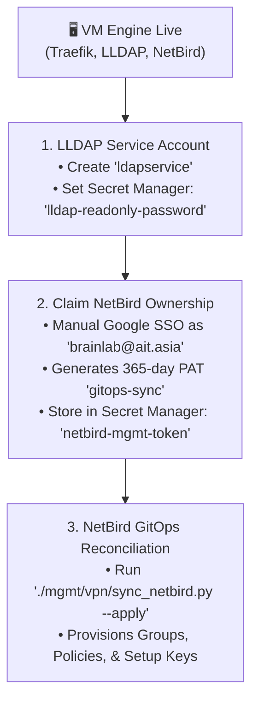

# AIT Brainlab Network-as-Code (NetBird GitOps)

## 📌 Overview
This directory serves as the **single source of truth** for all AIT Brainlab NetBird WireGuard mesh device groups, Zero-Trust access control policies, and server enrollment setup keys.

Network infrastructure is declared in [`network.yaml`](network.yaml) and synchronized to the live NetBird Management API via [`sync_netbird.py`](sync_netbird.py).

---

## 🏗️ Architecture & Core Principles

```
                  ┌──────────────────────────────┐
                  │ 📡 network.yaml (Git Source) │
                  └──────────────┬───────────────┘
                                 │
                   python3 sync_netbird.py --apply
                                 │
                                 ▼
                  ┌──────────────────────────────┐
                  │ 🚀 NetBird Management API    │
                  │  (https://netbird2.brain...) │
                  └──────────────┬───────────────┘
                                 │
     ┌───────────────────────────┼───────────────────────────┐
     │                           │                           │
     ▼                           ▼                           ▼
┌──────────────┐          ┌──────────────┐          ┌──────────────┐
│  Group Tags  │          │  Zero-Trust  │          │  Server Keys │
│ (loc-*,tier*)│          │   Policies   │          │  (Ansible)   │
└──────────────┘          └──────────────┘          └──────────────┘
```

1. **Composable 2-Tag Model**:
   - Location tags: `loc-onprem-csim`, `loc-onprem-lab`, `loc-cloud-gcp`, `loc-cloud-aws`.
   - Role/Tier tags: `tier-servers`, `tier-storage`, `tier-mgmt`, `tier-operators`, `tier-students`.
2. **Zero-Trust Micro-Segmentation**:
   - Least-privilege port policies isolate student laptops from one another while granting compute access to GPU servers (`:2222`, `:8888`, `:5000`).
3. **Secret Vault Security**:
   - Personal Access Tokens (PAT) live strictly in **GCP Secret Manager** (`netbird-mgmt-token`). Zero tokens stored on local disk or in version control.

---

## 🚀 How to Manage Network Infrastructure

### 1. Preview Changes (Dry-Run)
```bash
./mgmt/vpn/sync_netbird.py
```

### 2. Apply Changes to Live NetBird
```bash
./mgmt/vpn/sync_netbird.py --apply
```

---

## 🧭 Day 0.5 Post-Bootstrap Handover Sequence

Once the Day 0 Terraform VM Engine (`mgmt/terraform/vm/`) completes deployment and Traefik obtains Let's Encrypt certificates, the following one-time sequence initializes the live control plane:



### Why This Handover Exists (Chicken-and-Egg Prevention):
- **LLDAP**: A service account cannot be created until the database and API are reachable.
- **NetBird**: The REST API requires authentication by an Account Owner. On a brand-new database, no users exist until the master lab account (`brainlab@ait.asia`) completes the first Google SSO login.

---

## ⏰ PAT Expiration & Automated Renewal Reminders

NetBird Personal Access Tokens (PATs) have a maximum recommended lifespan of **365 days** for security compliance. Because NetBird tokens cannot be generated automatically without existing master credentials, renewal is a fast manual SOP assisted by **automated reminders**:

### 1. Automated Reminder Channels
1. **GitHub Action ([`.github/workflows/netbird_pat_reminder.yml`](../../.github/workflows/netbird_pat_reminder.yml))**:
   - Runs automatically on the 1st of every month.
   - Inspects the NetBird token expiration date via API.
   - Automatically opens a GitHub Issue labeled `security` and `maintenance` **30 days before expiration**.
2. **CLI Early-Warning Check**:
   - [`sync_netbird.py`](sync_netbird.py) automatically checks the expiration date on every execution and prints a bold warning if the token is within 30 days of expiry.

---

## 🔄 PAT Renewal Runbook (60 Seconds)

When an expiration alert is triggered:

1. **Log In**: Open [`https://netbird2.brain.cs.ait.ac.th`](https://netbird2.brain.cs.ait.ac.th) and sign in as `brainlab@ait.asia`.
2. **Generate New Token**:
   - Go to **Settings** (or User Icon) $\rightarrow$ **Access Tokens**.
   - Click **Create Access Token** (e.g. name: `gitops-sync-2027`, expiration: `365 days`).
   - Copy the new token (`nbp_...`).
3. **Update GCP Secret Manager**:
   ```bash
   echo -n "nbp_NEW_TOKEN" | gcloud secrets versions add netbird-mgmt-token --data-file=- --project=ait-brainlab-mgmt
   ```
4. **Verify Live Sync**:
   ```bash
   ./mgmt/vpn/sync_netbird.py
   ```
5. **Revoke Old Token**: In the NetBird Web Dashboard, revoke the previous token.

