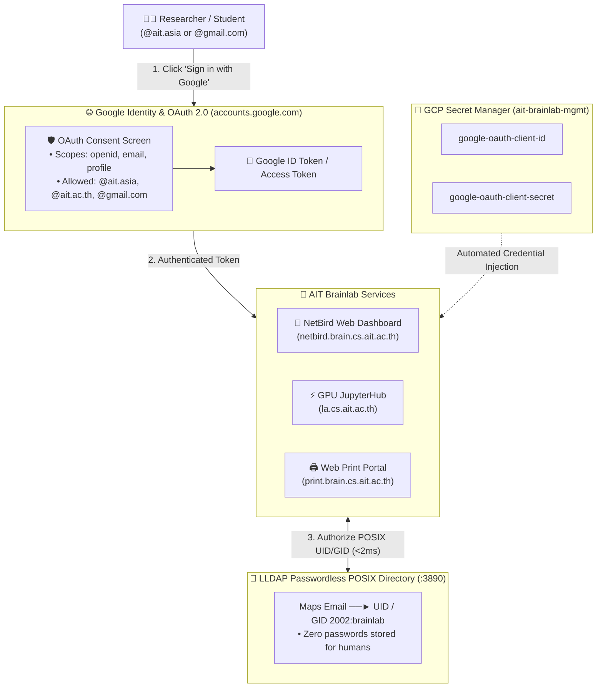

# Google OAuth2 / OIDC Single Sign-On Setup Guide (`services/identity/oauth`)

> **Unified Identity Provider**: Handles 100% of human authentication, passwords, and 2FA for **NetBird Mesh VPN**, **JupyterHub**, and the **Remote Web Print Portal** using institutional `@ait.asia`, `@ait.ac.th`, and approved alumni `@gmail.com` accounts.

---

## 🛡️ Why This is a One-Time Console Step (Not in Terraform)

Google Cloud Platform enforces a strict security boundary: **Generic OAuth 2.0 Web Client IDs cannot be created via Terraform or API**. 

Google intentionally requires a human project owner to approve the **OAuth Consent Screen** (branding, privacy policy, contact email) in the Google Cloud Console. 

Once created **one time**, the credentials are saved in **GCP Secret Manager**, and all subsequent deployments across Terraform, NetBird, JupyterHub, and Web Print fetch them automatically.

---

## 🏗️ Authentication & Single Sign-On Architecture



---

## 📋 Step-by-Step Google Cloud Console Walkthrough

### Step 1: Configure OAuth Consent Screen (If First Time)
1. Open the [**GCP OAuth Consent Screen**](https://console.cloud.google.com/apis/credentials/consent?project=ait-brainlab-mgmt).
2. Choose **User Type**: **External** *(allows both `@ait.asia` institutional accounts and `@gmail.com` alumni)*.
3. Fill in basic information:
   - **App name**: `AIT Brainlab`
   - **User support email**: `brainlab@ait.asia`
   - **Developer contact information**: `brainlab@ait.asia`
4. Under **Scopes**, add:
   - `.../auth/userinfo.email`
   - `.../auth/userinfo.profile`
   - `openid`
5. Click **Save and Continue**.

---

### Step 2: Create the OAuth 2.0 Web Client ID
1. Navigate to the [**GCP Credentials Page**](https://console.cloud.google.com/apis/credentials?project=ait-brainlab-mgmt).
2. At the top of the screen, click **`+ CREATE CREDENTIALS`** $\rightarrow$ **OAuth client ID**.
3. Set **Application type**: **Web application**.
4. Set **Name**: `AIT Brainlab SSO (NetBird, JupyterHub, Web Print)`.

5. **Authorized JavaScript Origins**:
   ```text
   https://netbird.brain.cs.ait.ac.th
   https://ldap.brain.cs.ait.ac.th
   https://la.cs.ait.ac.th
   https://print.brain.cs.ait.ac.th
   ```

6. **Authorized Redirect URIs**:
   ```text
   https://netbird.brain.cs.ait.ac.th
   https://netbird.brain.cs.ait.ac.th/auth
   https://netbird.brain.cs.ait.ac.th/silent-auth
   http://localhost:53000
   https://la.cs.ait.ac.th/hub/oauth_callback
   https://print.brain.cs.ait.ac.th/oauth2/callback
   ```

7. Click **CREATE**.

---

### Step 3: Store Client ID & Secret in GCP Secret Manager
```bash
# 1. Store Client ID
echo -n "YOUR_CLIENT_ID.apps.googleusercontent.com" | \
  gcloud secrets versions add google-oauth-client-id --data-file=- --project=ait-brainlab-mgmt

# 2. Store Client Secret
echo -n "GOCSPX-YOUR_CLIENT_SECRET" | \
  gcloud secrets versions add google-oauth-client-secret --data-file=- --project=ait-brainlab-mgmt
```

---

## 🔍 How Services Use These Credentials

| Service | Configuration Method | Behavior |
| :--- | :--- | :--- |
| **📡 NetBird Web UI** | Read from Secret Manager $\rightarrow$ `docker-compose.yml` (`AUTH_CLIENT_ID`) | Shows 1-click Google Sign-in button on `https://netbird.brain.cs.ait.ac.th` |
| **⚡ JupyterHub** | Read from Secret Manager $\rightarrow$ `jupyterhub_config.py` (`OAuthenticator`) | 1-Click login on `https://la.cs.ait.ac.th` spawning user GPU notebook |
| **🖨️ Web Print Portal** | Read from Secret Manager $\rightarrow$ OAuth2 Proxy | Protects `https://print.brain.cs.ait.ac.th` requiring Google login before PDF upload |

---

## 🛠️ Rotating or Updating Redirect URIs

If a new lab service or staging domain is added in the future:
1. Open [**GCP Credentials Page**](https://console.cloud.google.com/apis/credentials?project=ait-brainlab-mgmt).
2. Click the edit icon on **AIT Brainlab SSO**.
3. Add the new origin and redirect URI under **Authorized Redirect URIs**.
4. Click **Save** (takes effect globally within 60 seconds).
