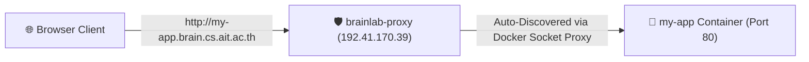

# 🚀 Web Service Deployment Template (`services/template/`)

> **Official AIT Brainlab Deployment Template**: Standard boilerplate for deploying web applications, research demos, and APIs auto-discovered by the `brainlab-proxy` edge proxy (`192.41.170.39`).

---

## 📌 How Auto-Discovery Works

Any container deployed on any application VM (`dlms-server`, `ml`, `tokyo`, `cairo`) automatically advertises itself to `brainlab-proxy` by attaching **Traefik Labels** to the container.



---

## 🛠️ Step-by-Step Deployment Guide

### 1. Copy the Template `docker-compose.yml`
Copy `services/template/docker-compose.yml` into your project repository or server folder.

### 2. Customize Docker Labels
Update the labels under your application container in `docker-compose.yml`:

```yaml
labels:
  - "traefik.enable=true"
  - "traefik.http.routers.<app-name>-router.rule=Host(`<app-name>.brain.cs.ait.ac.th`)"
  - "traefik.http.services.<app-name>-router.loadbalancer.server.port=80"
```

Replace `<app-name>` with your service name (e.g. `dlms-dev`, `my-demo`, `api`).

### 3. Deploy Container Stack
On your application server (e.g. `dlms-server`), run:

```bash
docker compose up -d
```

### 4. Verify Auto-Discovery
The moment your container starts, `brainlab-proxy` automatically begins routing traffic to your domain without any manual server configuration!
